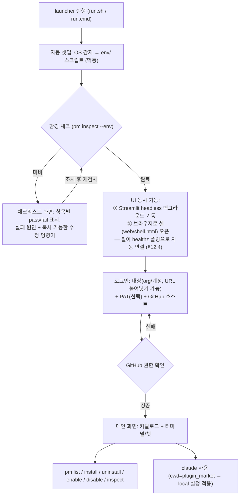
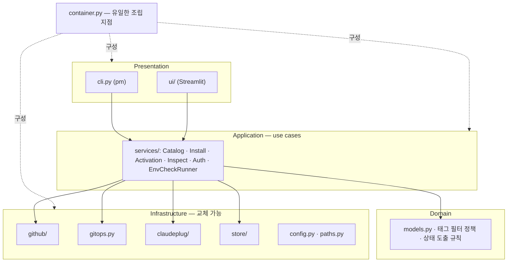
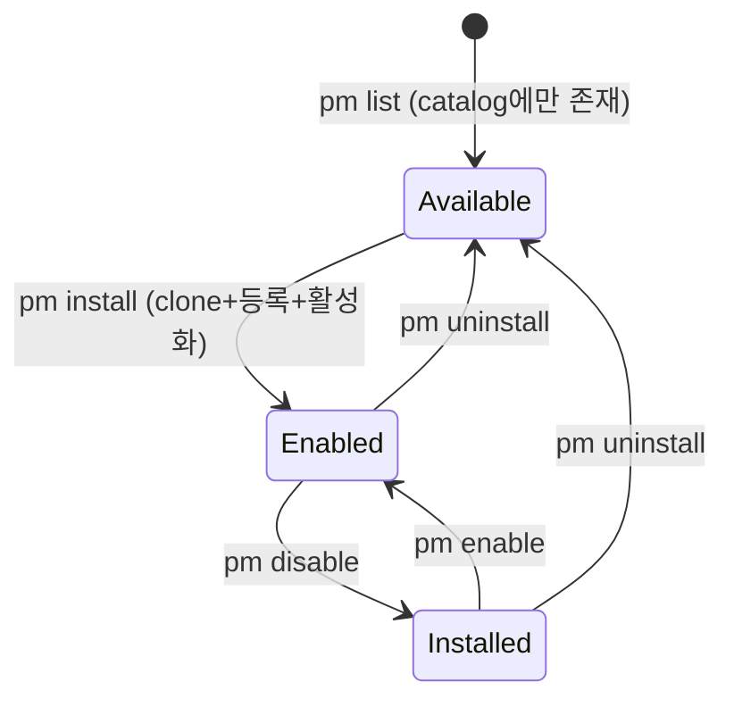

# plugin_market — Architecture

> Claude Code에서 사용할 plugin을 GitHub organization에서 검색·설치·활성화·관리하는 시스템.
> [prompts.txt](../prompts.txt)를 요구사항 원천으로 하며, 1차 프로토타입(Streamlit, 2026-07 폐기)에서 검증된 사실을 반영한 **본격 구현용 설계문서**이다.

---

## 1. 개요 및 목표

### 1.1 목적

- 특정 GitHub organization(또는 계정)에 흩어져 있는 Claude plugin을 **한 곳에서 검색·설치·활성화**한다.
- 사용자는 launcher 하나만 실행하면 환경 셋업 → 체크리스트 → 로그인 → 플러그인 관리 → claude 사용까지 이어진다.
- `pm` CLI와 Streamlit UI가 **동일한 core 로직**을 공유한다.

### 1.2 용어

| 용어 | 정의 |
|---|---|
| **plugin** | description에 `#plugin` `#release` 태그가 있는 GitHub repo. Claude Code 플러그인 규약(부록 A)을 따름 |
| **catalog** | GitHub 스캔 결과 캐시 (`data/plugins.json`) |
| **marketplace** | Claude Code 네이티브 플러그인 등록 지점. 본 프로젝트 루트의 `.claude-plugin/marketplace.json`을 pm이 생성·갱신 |
| **local claude** | plugin_market 디렉토리를 cwd로 실행되는 claude — `CLAUDE.md`와 `.claude/` 설정이 적용된 인스턴스 |

### 1.3 핵심 컨셉

| 항목 | 내용 |
|---|---|
| 플러그인 소스 | GitHub org/계정 repo 중 description에 `#plugin` + `#release`가 있는 것 |
| 설치 | `git clone` → `plugins/{name}` 저장 → 로컬 marketplace에 등록 |
| 활성화 | Claude Code 네이티브 `enabledPlugins` 토글 (§6) |
| 동작 범위 | local claude 기준 — 모든 등록·관리는 `plugin_market/.claude`(및 `.claude-plugin/`)에서 |
| 사용 방법 | `pm` shim을 PATH에 등록해 어디서든 `pm list` … + Streamlit UI |
| 플랫폼 | Windows / Linux (개발은 macOS 포함) |

---

## 2. 설계 원칙 — [코드 규정] 대응

### 2.1 Google Python Style Guide 준수

세부 규칙은 §13. 요약: snake_case 모듈/함수, CapWords 클래스, Google 형식 독스트링, 절대 임포트, 공개 API 타입 힌트 필수, 예외 계층화.

### 2.2 SOLID 적용표

| 원칙 | 본 설계 적용 지점 |
|---|---|
| **S**RP | 프로토타입의 `github.py`(설정읽기+URL정책+HTTP+필터 혼재)를 `config / urls / rest_client / scanner`로 분리. `installer.py`(git+링크+상태 혼재)를 `gitops / claudeplug / inspect_service`로 분리 |
| **O**CP | 새 환경 체크 = `Check` 구현체 1개 추가. 새 GitHub 계열 = `ApiUrlBuilder` 규칙 추가. 기존 코드 수정 없음 |
| **L**SP | `RestGitHubClient` ↔ `FakeGitHubClient`(테스트) ↔ 향후 `GhCliClient`가 `GitHubClient` Protocol 뒤에서 호환 |
| **I**SP | `InstallService`는 `GitRunner+ClaudePluginRegistry+Catalog`만, `ActivationService`는 `ClaudePluginRegistry`만 의존. UI는 렌더링에 필요한 서비스 메서드에만 의존 |
| **D**IP | **container.py(조립 지점) 외에는 어떤 모듈도 구체 클래스를 생성하거나 전역 설정을 읽지 않는다.** API 주소·토큰·경로·태그는 모두 생성자로 주입 |

### 2.3 "변할 수 있는 값" 목록과 변경 방법

> [코드 규정] "github URL은 언제나 바뀔 수 있으므로 변경이 용이" 대응.

| 값 | 기본값 | 변경 방법 (우선순위: CLI 플래그 > 환경변수 > config.json > 기본값) |
|---|---|---|
| `github_host` | `github.com` | UI 로그인 화면 / `config.json` / `PM_GITHUB_HOST` |
| `github_api_base` | 호스트에서 규칙 유도 (§10.3) | `config.json`에 명시하면 규칙보다 우선 (수동 override) |
| `github_target` | `ageokim` | UI 로그인 화면 / `config.json` |
| `plugin_tags` | `["#plugin", "#release"]` | `config.json` |
| `ca_bundle` | 없음 (시스템 기본) | `config.json` — 사내 인증서 환경 (§10.5) |
| 프로젝트 경로들 | `paths.py`의 `ProjectPaths` | 테스트에서 주입 교체 |
| 타임아웃/페이지 크기 | `config.py` 상수 | `config.json` |

### 2.4 no-venv 원칙 (해석 명문화)

> [코드 규정] "가상환경 사용안함" — **venv/virtualenv를 일절 만들지 않는 엄격한 해석**을 채택한다
> (내부적으로 venv를 만드는 pipx·uv tool도 배제). 격리 대신 **검증**으로 대응: 버전 충돌은
> 환경 체크리스트가 감지해 수정 명령을 제시한다. 전략 상세는 §9.

---

## 3. 전체 사용자 흐름



- 체크리스트 화면은 실패 항목마다 "왜 실패했는지 + 지금 실행할 명령어"를 보여주고, 재검사 버튼으로 다시 확인한다.
- 로그인 성공 후에만 GitHub 스캔·설치 기능이 열린다. public repo만 쓸 경우 PAT는 생략 가능.

---

## 4. 레이어 구조



- 의존 방향은 항상 안쪽(추상)으로. Infrastructure는 `typing.Protocol`로 정의된 인터페이스의 구현체.
- **CLI와 UI는 동일한 services를 호출한다** — 프로토타입에서 비즈니스 로직이 UI에 새어나간 문제(스캔·병합 로직이 app.py에 존재)의 재발 방지 규칙.

---

## 5. 모듈 설계

패키지는 `scripts/pm/` (파이썬 패키지명 `pm`).

| 모듈 | 단일 책임 | 핵심 인터페이스 |
|---|---|---|
| `paths.py` | 프로젝트 경로의 유일한 정의처. `ROOT = Path(__file__)` 기준(cwd 무관) — `ProjectPaths` dataclass로 주입 가능 | — |
| `config.py` | 계층 설정: 기본값 → `data/config.json` → 환경변수(`PM_*`) → CLI 플래그 | `ConfigProvider` |
| `errors.py` | `PmError` → `GitHubError / GitOpsError / RegistryError / ConfigError` | — |
| `models.py` | 불변 dataclass: `Plugin(name, github_addr, clone_url, description, private, has_tags)`, `PluginState` enum(Available/Installed/Enabled), `CheckResult(id, passed, detail, fix_command)` | — |
| `github/client.py` | Protocol: `verify_token`, `resolve_target`, `fetch_repos`, `check_org_membership` | `GitHubClient` |
| `github/rest_client.py` | requests 구현체. **생성자로 `api_base_url`, `token_provider`, `ca_bundle` 주입** — 설정을 직접 읽지 않음 | 구현 |
| `github/urls.py` | `ApiUrlBuilder`(host→API base 규칙), `parse_host`, `parse_target`(dot-heuristic) | — |
| `github/scanner.py` | 도메인 정책: description이 설정된 태그를 **모두** 포함하는 repo 필터 | — |
| `store/json_store.py` | `data/*.json` 원자적 입출력(임시파일+rename — CLI·UI 동시 쓰기 대비), 손상 시 기본값+경고 로그 | `PluginCatalog` |
| `gitops.py` | `GitRunner` Protocol + subprocess 구현: `clone`(토큰은 §11 방식), `pull`, `head_commit`. `GIT_TERMINAL_PROMPT=0` | `GitRunner` |
| `claudeplug/registry.py` | **하이브리드 등록의 핵심** (§6): marketplace.json 생성·갱신, `enabledPlugins` 토글, 규약 검사 | `ClaudePluginRegistry` |
| `services/catalog_service.py` | `pm list`: 스캔 → 태그 필터 → catalog 저장. `--cached` 경로 | — |
| `services/install_service.py` | `pm install/uninstall`: clone → 등록 / 등록해제 → 삭제(실패 시 부분 clone 정리) | — |
| `services/activation_service.py` | `pm enable/disable`: registry 위임 | — |
| `services/inspect_service.py` | `pm inspect`: 파일시스템·marketplace·enabledPlugins 실측 대조, 규약 검사, `--repair` | — |
| `services/auth_service.py` | 토큰 검증(GET /user) + org 멤버십 확인, 세션 컨텍스트 생성 | — |
| `envcheck/checker.py` | `Check` Protocol(`id`, `title`, `run()`) + 등록된 체크 목록 실행기 | `Check` |
| `envcheck/checks.py` | 구체 체크들 (§9.4 표) | `Check` 구현 |
| `system/process.py` | cwd=ROOT subprocess 실행, 외부 터미널 실행(OS별) | `CommandRunner` |
| `container.py` | **조립 루트** — 설정 읽기, 구현체 생성·주입은 여기서만 | — |
| `cli.py` + `__main__.py` | argparse 디스패치 → services, 표 출력, 종료코드(0 정상/1 오류/2 사용법). `python -m pm` | — |

UI: `scripts/app.py`(진입점·화면 라우팅만) + `scripts/ui/{checklist,login,plugins,terminal}_view.py`, `ui/state.py`. container는 `st.cache_resource`로 1회 조립.

**테스트 전략이 DIP에서 자동으로 나온다**: services는 Fake 구현체(가짜 GitHubClient, 임시 디렉토리 ProjectPaths, 기록형 GitRunner)로 네트워크·실제 `.claude` 없이 단위 테스트한다 (§13.3).

---

## 6. 플러그인 등록 메커니즘 — 하이브리드 (네이티브 marketplace 위임)

### 6.1 결정 배경

prompts.txt는 `.claude`에 심볼릭 링크(plugin_root_path, project_path) 등록을 명시했으나, 프로토타입 검증 과정에서 다음이 확인되어 **등록·활성화를 Claude Code 네이티브 플러그인 시스템에 위임하는 하이브리드 방식으로 재해석**한다:

1. 프로토타입이 사용한 `.claude/plugins/{name}` 링크는 **Claude Code가 읽지 않는 경로**다 (Claude Code가 읽는 것: `.claude/commands|agents|skills|rules/`, `settings.json`).
2. 심볼릭 링크로 가려면 repo 내용물을 종류별로 `.claude/skills/` 등에 나눠 링크해야 하며, Windows에서 symlink 권한(개발자 모드)·junction 제약(절대경로 전용, `Path.is_junction()`은 Python 3.12+, 링크에 rmtree 시 원본 삭제 사고)을 모두 짊어진다.
3. 네이티브 방식은 **링크 자체가 불필요**해 Windows 리스크가 소멸하고, hooks·MCP·버전 관리까지 표준 UX(`/plugin`)로 지원된다.

역할 분담: **pm = clone·인증·카탈로그·규약검사** (사내 GHES PAT 인증은 pm이 처리하므로 claude에 자격증명 전달 불필요) / **Claude Code = 등록·활성화·로딩**.

### 6.2 동작 흐름

```
pm install plugin-a
├─ 1. git clone {clone_url}  →  plugins/plugin-a          (pm, 토큰은 §11 방식)
├─ 2. 규약 검사: .claude-plugin/plugin.json 존재 등 (부록 A)
├─ 3. .claude-plugin/marketplace.json에 항목 추가·갱신     (pm)
│      마켓플레이스 이름: "plugin-market" (디렉토리명 plugin_market과 달리
│      하이픈 — marketplace name 규칙에 맞춤. enabledPlugins 키의 @ 뒤 부분)
│      { "name": "plugin-market",
│        "plugins": [ { "name": "plugin-a", "source": "./plugins/plugin-a" } ] }
└─ 4. 활성화: .claude/settings.local.json의
       "enabledPlugins": { "plugin-a@plugin-market": true }  토글

pm disable plugin-a   → enabledPlugins 값을 false로 (clone·등록 유지)
pm enable  plugin-a   → true로
pm uninstall plugin-a → enabledPlugins 항목 제거 → marketplace.json 항목 제거
                        → plugins/plugin-a 삭제 (Windows read-only .git 대응 onexc 포함)
pm update  plugin-a   → git pull → 재설치 트리거 (§6.3 캐시 특성 흡수)
```

- plugin_market 루트가 곧 **로컬 마켓플레이스**가 된다: `.claude-plugin/marketplace.json`의 source는 상대경로 `./plugins/{name}` — 저장소를 옮겨도 깨지지 않는다(프로토타입의 상대 심볼릭 링크 원칙 계승).
- `enabledPlugins`는 머신별 상태이므로 **`.claude/settings.local.json`**(git 비추적)에 둔다. 팀 공통 설정(권한 allowlist 등)은 `.claude/settings.json`(커밋).
- 구현은 settings 파일 직접 편집 또는 `claude plugin enable/disable --scope project` CLI 위임 중 택일 — `claudeplug/registry.py` 뒤에 숨겨 어느 쪽이든 교체 가능(OCP).

### 6.3 주의: 설치 캐시 복사와 플러그인의 root path

Claude Code는 marketplace 플러그인 설치 시 디렉토리 **트리 전체를 캐시로 복사**한다
(`~/.claude/plugins/cache/{plugin}-{version}/` — 내부 구조 보존):

- `plugins/{name}`에서 `git pull`만 해서는 반영되지 않는다 → `pm update` = `git pull` + 재설치로 흡수, `pm inspect`가 clone HEAD와 설치본의 차이를 표시.
- **런타임에 플러그인이 보는 "자기 root"는 `plugins/{name}`이 아니라 캐시 복사본이다.** Claude Code가 이를 위해 제공하는 공식 변수:
  - `${CLAUDE_PLUGIN_ROOT}` — 설치된(캐시) 플러그인 루트 절대경로. hooks·`.mcp.json`·monitors에서 치환되고 환경변수로도 export됨
  - `${CLAUDE_PLUGIN_DATA}` — 버전 업데이트를 넘어 유지되는 영속 데이터 디렉토리(`~/.claude/plugins/data/{plugin}/`)
- 트리가 통째로 복사되므로 **skill이 자기 폴더 내 파일을 상대경로로 참조하는 것은 그대로 동작**한다 (`skills/x/SKILL.md` → `./scripts/run.py` OK).
- **함정 — cwd**: hook/monitor 스크립트의 작업 디렉토리는 플러그인 폴더가 아니라 **세션 cwd(= plugin_market 루트)**다. "현재 디렉토리 = 내 플러그인 폴더"를 가정한 스크립트는 깨진다 → `cd "${CLAUDE_PLUGIN_ROOT}" && …` 패턴 필수 (부록 A.5 경로 규칙).

### 6.4 상태 모델



**상태는 저장하지 않고 실측으로 도출한다** (프로토타입 검증 원칙 — 저장 상태는 반드시 드리프트한다):
- `Installed` = `plugins/{name}` 존재 ∧ marketplace.json에 등록
- `Enabled` = Installed ∧ `enabledPlugins["{name}@plugin-market"] == true`
- catalog(JSON)는 스캔 캐시일 뿐, 진실은 파일시스템+설정 파일이다. `pm inspect`가 불일치를 감지·`--repair`로 재동기화한다.

---

## 7. pm CLI 명세

| 명령 | 동작 | 주요 옵션 |
|---|---|---|
| `pm list` | GitHub 스캔(§10) → 태그 필터 → catalog 갱신 → 이름/주소/상태 표 출력 | `--cached`(API 호출 없이), `--all`(태그 필터 해제), `--json` |
| `pm install [name]` | 인자 없으면 catalog 번호 선택 → clone → 규약검사 → 등록 → 활성화 (§6.2) | `--no-enable` |
| `pm uninstall <name>` | 활성화 해제 → 등록 해제 → clone 삭제 | |
| `pm enable <name>` | `enabledPlugins` true | |
| `pm disable <name>` | `enabledPlugins` false | |
| `pm inspect [name]` | 상태 실측 리포트: clone/등록/활성화/규약/버전차 | `--env`(§9.4 환경 체크), `--repair`, `--json` |
| `pm update [name]` | git pull + 재설치 (생략 시 전체) | |

- 종료 코드: 0 정상 / 1 실행 오류 / 2 사용법 오류. `--json`은 UI·스크립트 연동용.
- CLI는 어디서 실행해도 동작한다: shim이 자기 위치로 ROOT를 찾고(§9.3), 모든 파일 연산은 ROOT 기준 절대경로.

---

## 8. 데이터 설계

### 8.1 `data/config.json` — 설정 (git 비추적)

```json
{
  "github_host": "github.com",
  "github_api_base": null,
  "github_target": "ageokim",
  "plugin_tags": ["#plugin", "#release"],
  "ca_bundle": null,
  "terminal_mode": "chat"
}
```

- `github_api_base`가 null이면 host에서 규칙 유도(§10.3), 값이 있으면 그대로 사용(비표준 GHE 대응 override).
- 토큰은 **어떤 파일에도 저장하지 않는다** (§11).

### 8.2 `data/plugins.json` — catalog (스캔 캐시, git 비추적)

```json
{
  "target": "ageokim",
  "kind": "user",
  "updated_at": "2026-07-12T05:00:00+00:00",
  "plugins": [
    {
      "name": "plugin-a",
      "github_addr": "https://github.com/ageokim/plugin-a",
      "clone_url": "https://github.com/ageokim/plugin-a.git",
      "description": "... #plugin #release",
      "private": true,
      "has_tags": true
    }
  ]
}
```

- prompts.txt의 최소 스키마 `{plugin name, github addr}`를 포함하는 확장형.
- **`installed`/`enabled` 같은 상태 필드는 두지 않는다** — §6.4의 실측 원칙. envelope(target/kind/updated_at)로 "언제 어느 대상을 스캔한 캐시인지"를 기록해, 로그인 대상과 캐시 대상이 다르면 UI가 재스캔을 유도한다.

### 8.3 `data/env.json` — 고정된 인터프리터 (git 비추적)

```json
{ "python": "/usr/bin/python3.12" }
```

### 8.4 Claude Code 측 파일

| 파일 | 내용 | git |
|---|---|---|
| `.claude-plugin/marketplace.json` | pm이 관리하는 로컬 마켓플레이스 (설치된 플러그인 목록) | 비추적 권장 |
| `.claude/settings.json` | 팀 공통: 권한 allowlist(§12.2), env 등 | 커밋 |
| `.claude/settings.local.json` | 머신별: `enabledPlugins`, provider 전환 env(§12.3) | 비추적 |

---

## 9. 실행 / 환경 전략 (no-venv)

### 9.1 핵심 규칙: "인터프리터 고정 + 모든 실행은 `python -m`"

no-venv 환경의 대표 사고는 ① 설치한 python과 실행하는 python이 다른 것, ② console script가 PATH에 없는 것이다. 둘 다 원천 차단한다:

1. 셋업 시 인터프리터 탐색(Windows `py -3` → `python`, Store stub 제외 / Linux `python3` → `python`) 후 **절대경로를 `data/env.json`에 기록**.
2. 이후 모든 실행은 기록된 인터프리터로: `"$PYTHON" -m pm ...`, `"$PYTHON" -m streamlit run scripts/app.py`. → `streamlit`/`pip` 명령이 PATH에 있을 필요가 없다.

### 9.2 의존성 설치 (PEP 668 대응)

```
"$PYTHON" -m pip install --user -r env/requirements.txt
  └─ 실패가 externally-managed-environment(PEP 668, Debian 12+/Ubuntu 23.04+)면:
     "$PYTHON" -m pip install --user --break-system-packages -r env/requirements.txt 재시도
     (--user 결합 시 시스템 site-packages는 건드리지 않음)
```

- 빠른 경로: `"$PYTHON" -c "import streamlit, requests"` 성공 시 설치 전체 생략 (멱등·오프라인 친화).
- user-site는 머신 전역 공유라 **버전 드리프트가 가능** → 격리 대신 체크리스트가 `importlib.metadata.version()`으로 요구 범위와 대조·감지한다.
- `env/requirements.txt`: `streamlit>=1.35`, `requests>=2.31`, `claude-agent-sdk`(§12.3 채택 시).

### 9.3 `pm` 노출 — shim + PATH (prompts.txt "pm.bin")

- `scripts/bin/pm`(POSIX sh): 자기 위치에서 ROOT 계산 → `exec "$PYTHON" -m pm "$@"`. `scripts/bin/pm.cmd`: `%~dp0` 기반 동일 동작.
- ROOT 탐색 우선순위: shim 자기위치 → `PM_HOME` 환경변수(override) → 파이썬 모듈 위치(`paths.py`, 최종 방어).
- PATH 등록(`env/` 셋업, 멱등): Linux는 `~/.local/bin/pm` 심볼릭 링크(로그인 시 자동 PATH 포함), Windows는 `[Environment]::SetEnvironmentVariable("Path", ..., "User")` — **`setx`는 1024자 절단 버그로 금지**. 새 터미널부터 반영됨을 안내.
- launcher 진입점: `run.sh`(linux) / `run.cmd`(windows — 내부에서 `powershell -NoProfile -ExecutionPolicy Bypass -File env\setup_win.ps1` 호출로 실행 정책 우회).

### 9.4 환경 체크리스트 (엔진: `envcheck/`, UI 화면 + `pm inspect --env` 공용)

| # | 항목 | 검사 | 실패 시 수정 명령 (OS별 제시) |
|---|---|---|---|
| 1 | python ≥ 3.10 발견 | 탐색 규칙(§9.1) + 버전 | `winget install Python.Python.3.12` / `sudo apt install python3` |
| 2 | pinned 인터프리터 일치 | env.json 경로 실존·버전 | 셋업 재실행 (재탐색·재기록) |
| 3 | pip 동작 | `"$PYTHON" -m pip --version` | `"$PYTHON" -m ensurepip --user` |
| 4 | PEP 668 마커 | `EXTERNALLY-MANAGED` 존재 (정보성) | 설치 시 `--break-system-packages` 자동 적용 안내 |
| 5 | 패키지 버전 | import + `importlib.metadata` 범위 대조 | §9.2 설치 명령 |
| 6 | git | `git --version` | `winget install Git.Git` / `sudo apt install git` |
| 7 | claude CLI | `claude --version` | `npm install -g @anthropic-ai/claude-code` |
| 8 | `pm` PATH | `shutil.which("pm")`이 **이 checkout의 shim**인지 (타 checkout 오염 감지) | `env/` 셋업 재실행 |
| 9 | GitHub 호스트 도달성 | API base HEAD 요청 (§10.5 인증서 포함) | 프록시/ca_bundle 설정 안내 |
| 10 | `.claude` 구조 | settings 파일·marketplace.json 정합 | `pm inspect --repair` |

각 항목은 `Check` 구현체 하나 — 항목 추가가 기존 코드를 건드리지 않는다(OCP).

---

## 10. GitHub 연동 세부 (프로토타입 검증 사실)

### 10.1 repo 조회 3분기 — 가장 비용이 들었던 학습

| 대상 | 엔드포인트 | 이유 |
|---|---|---|
| organization | `GET /orgs/{name}/repos?type=all` | 토큰 권한 내 private 포함 |
| 타인/일반 user | `GET /users/{name}/repos?type=owner` | **`type=all`은 collaborator로 참여한 남의 repo까지 포함** (오염) |
| **본인** (토큰 로그인 == 대상) | `GET /user/repos?type=owner` | **`/users/{name}/repos`는 토큰이 있어도 public만 반환** — 본인 private는 이 경로만 |

- org/user 판별: `GET /orgs/{name}` 성공 → org, 실패 시 `GET /users/{name}` → user.
- 페이지네이션: `per_page=100` + `Link: rel="next"` 헤더 추적 (누락 시 100개 초과 org에서 조용히 잘림).
- 403 구분: 본문에 rate limit 문구 → "PAT를 넣으면 한도 상승(미인증 60/h → 인증 5,000/h)" 안내. GHES는 rate limit이 꺼져 있을 수 있으므로 `X-RateLimit-*` 헤더 존재를 가정하지 않는다.

### 10.2 인증

- GitHub은 아이디/암호 API 인증 폐지(2020) → **"암호"란에 PAT** (`repo`, `read:org` 스코프). 토큰 형식(`ghp_*`/`github_pat_*`)으로 검증하지 말 것 — GHES는 형식이 다를 수 있다. **`GET /user` 성공 여부로만 판정**.
- org 대상 로그인 시 `GET /user/memberships/orgs/{org}`로 멤버십 확인. 실패 ≠ 접근 불가(공개 repo는 조회 가능) — UI는 경고만.

### 10.3 호스트 → API base 규칙 ("URL 변경 용이"의 구현)

```
github.com            → https://api.github.com
그 외 (GHES)          → https://{host}/api/v3
config.github_api_base 지정 시 → 그 값 (수동 override, GHE Cloud *.ghe.com 등 비표준 대응)
```

### 10.4 URL 파싱 (dot-heuristic)

로그인 입력은 이름/URL/SSH 어느 형태든 허용: 스킴 제거 → `git@host:org` 정규화 → userinfo(`@`) 조각 제거 → **첫 조각에 점(.)이 있으면 호스트로 보고 버림** (GitHub 계정명에는 점이 올 수 없다). 어떤 호스트가 와도 하드코딩 없이 동작.

### 10.5 사내망 (GHES) 추가 고려

- self-signed 인증서·MITM 프록시는 세 곳을 동시에 깨뜨린다 → config `ca_bundle` 하나로 전파: `requests(verify=...)`, `git -c http.sslCAInfo=...`, claude 실행 env `NODE_EXTRA_CA_CERTS`. `verify=False`는 명시적 opt-in 플래그로만.
- `HTTP(S)_PROXY`/`NO_PROXY` 전파 여부는 체크리스트 항목 9에서 함께 진단.

---

## 11. 보안

| 항목 | 규칙 |
|---|---|
| PAT 보관 | **세션 메모리만** (Streamlit `session_state` / CLI는 프로세스 수명). 디스크 기록 금지. 새로고침 시 재로그인 감수. keyring 연동은 로드맵(§15) |
| private clone 자격증명 | 프로토타입의 `git -c http.extraHeader=...`는 **프로세스 인자로 토큰이 `ps`에 노출** → `GIT_CONFIG_COUNT/GIT_CONFIG_KEY_0/GIT_CONFIG_VALUE_0` **환경변수 방식**으로 교체 (같은 효과, 인자 노출 없음, `.git/config`에도 안 남음). `GIT_TERMINAL_PROMPT=0`으로 인증 실패 시 대기 없이 즉시 오류 |
| Streamlit 노출 | `.streamlit/config.toml`에 `server.address = "localhost"` 고정 — Streamlit에는 자체 인증이 없다 |
| headless claude 권한 | `--dangerously-skip-permissions` 기본 사용 금지. `.claude/settings.json`의 허용 목록(allowlist) 사전 구성으로 대응 (§12.2) |

---

## 12. 터미널 / 챗 화면 및 Claude 인터페이스

### 12.1 두 가지 모드 (config `terminal_mode`, 병행 제공)

| | (A) 내장 챗 (기본) | (B) 외부 터미널 |
|---|---|---|
| 구현 | Streamlit 챗 UI + Claude Agent SDK(§12.3) 또는 `claude -p --output-format stream-json` subprocess, cwd=ROOT | OS 터미널 새 창 (win: `wt.exe` → `start powershell` 폴백 / linux: gnome-terminal 등 탐색), cwd=ROOT |
| pm 명령 | subprocess가 아니라 **동일 프로세스에서 services 직접 호출** (출력·오류 처리 용이) | 터미널에서 `pm ...` |
| claude | 스트리밍 표시, `--resume`으로 세션 연속 | 완전한 대화형 claude 그대로 |
| SSH | **VSCode Remote SSH에서도 동작** (포트 포워딩) | 원격에서는 불가 — `SSH_CONNECTION` 감지 시 버튼 숨기고 "VSCode 내장 터미널에서 pm/claude 실행" 안내 |

두 모드 모두 cwd=plugin_market이므로 local `CLAUDE.md`·`.claude/` 설정·활성화된 플러그인이 적용된다.

### 12.2 headless 권한 정책

내장 챗의 claude는 권한 승인 프롬프트를 띄울 수 없다 → `.claude/settings.json`에 팀 공통 허용 목록을 사전 구성하고, 필요 시 `--permission-mode`를 명시한다. skip-permissions는 금지(§11).

### 12.3 Claude 인터페이스 제작 — Agent SDK와 provider 전환 (검토사항 6)

> 질문: "anthropic 라이브러리 사용 → settings.local.json으로 provider 환경을 바꾸면서 등록 skill&workflow 사용 가능한가? claude interface 제작"

**가능하다. 단, raw `anthropic` 라이브러리가 아니라 Claude Agent SDK를 써야 한다** (문서 확인 완료):

| | raw `anthropic` 라이브러리 | **Claude Agent SDK** (`pip install claude-agent-sdk`) |
|---|---|---|
| 실체 | Messages API 클라이언트일 뿐 | Claude Code 엔진을 headless로 감싼 SDK |
| `.claude` settings/env 로딩 | ✗ | ✓ (`setting_sources=["project","local"]` — 기본값은 user/project/local 모두) |
| skills / plugins / CLAUDE.md | ✗ (직접 구현해야 함) | ✓ (cwd=plugin_market으로 실행 시 로컬 등록분 로딩) |
| 도구 실행 루프 | 직접 코딩 | 자동 |

- **provider 전환**: `.claude/settings.local.json`의 `env` 블록이 세션에 적용된다. `ANTHROPIC_BASE_URL`(프록시/게이트웨이), `ANTHROPIC_AUTH_TOKEN`/`ANTHROPIC_API_KEY`, `ANTHROPIC_MODEL`, `CLAUDE_CODE_USE_BEDROCK`, `CLAUDE_CODE_USE_VERTEX` 지원. local이 settings.json을 override하므로 **머신별로 provider를 바꿔도 등록된 skill·plugin은 그대로 동작**한다.

```python
from claude_agent_sdk import query, ClaudeAgentOptions

async for message in query(
    prompt=user_input,
    options=ClaudeAgentOptions(
        cwd=PROJECT_ROOT,                      # plugin_market
        setting_sources=["project", "local"],  # .claude 설정·skills·플러그인 로딩
    ),
):
    render(message)  # Streamlit 챗으로 스트리밍
```

- 폴백: SDK 미채택 시 `claude -p` subprocess도 프로젝트 설정·env 블록·플러그인을 동일하게 존중한다.

### 12.4 UI 커스터마이징 전략 (HTML / CSS / JS)

Streamlit 위에서 웹 디자인을 입히는 방법은 4단계로 나뉘며, 필요한 최소 단계만 쓴다:

| 레벨 | 방법 | 가능한 것 | 한계 |
|---|---|---|---|
| 1 | `.streamlit/config.toml` `[theme]` | 앱 전체 색·폰트·라운딩 | 톤 조정 수준 |
| 2 | `st.html()` / `st.markdown(unsafe_allow_html=True)`로 CSS 주입 + 정적 HTML | 커스텀 카드·배지·체크리스트 등 자유로운 마크업, 위젯 스타일 오버라이드 | **JS 실행 불가**. Streamlit 내부 클래스명(`.stButton` 등) 의존 CSS는 버전 업 시 깨질 수 있음 — 커스텀 클래스 중심으로 작성 |
| 3 | `st.iframe()` (구 `st.components.v1.html` — 1.59+에서 대체) | HTML+CSS+**JS**가 iframe 안에서 완전 동작 (애니메이션, JS 라이브러리) | iframe 격리 — 본체 스타일과 분리, **JS→Python 양방향 통신 불가** (단방향 표시) |
| 4 | Custom Component (React 등 + `Streamlit.setComponentValue`) | JS 이벤트를 Python으로 돌려받는 완전한 양방향 위젯 | Node 빌드 필요. 커뮤니티 컴포넌트(pip) 활용 가능 |

**본 프로젝트 적용 지침**:
- 체크리스트·플러그인 카드·상태 배지 → **레벨 2** (커스텀 클래스 CSS를 `ui/styles.py` 한 곳에 모음, 사용자 데이터는 `html.escape` 필수)
- 터미널/챗 화면을 실제 터미널 룩으로 (xterm.js 등) → **레벨 4** 영역 — xterm.js 기반 커뮤니티 컴포넌트 존재, 채택 여부는 구현 시 결정
- 페이지 전체 레이아웃/라우팅의 완전 재설계는 Streamlit rerun 모델 밖의 일 — 그 수준이 필요해지면 프레임워크 교체(FastAPI+프론트)를 검토하는 것이 맞다
- 임시 예시 코드: `example/` 폴더 (레벨 1~3 + 아래 임베드 셸 데모, 구조 파악용 — 추후 삭제 예정)

**임베드 셸 구성 (정적 HTML + Streamlit iframe) — 채택된 UI 구조**:

```
[정적 HTML 셸]  ← git 서버(GitHub/GHES Pages)에서 중앙 배포 — 디자인 100% 자유
 ├─ 헤더 · 네비 · 소개 · 매뉴얼 (정적 콘텐츠)
 └─ <iframe src="http://localhost:8501/?embed=true&section=…">
                 └─ 각 사용자 PC의 local Streamlit (?embed=true = 공식 임베드 모드, 껍데기 제거)
```

- 셸은 org repo에 두고 Pages로 서빙 → **git push 한 번으로 전 사용자에게 디자인·공지 배포**. 인터랙티브 영역(로그인·스캔·설치·챗)만 각자 로컬 Streamlit이 담당
- 셸 → Streamlit 통신은 iframe URL query param(`st.query_params` 수신) 단방향까지. 역방향 공식 경로 없음 — 상호작용은 iframe 안에서 완결
- 제약: ① 로컬 Streamlit 서버 필요, ② https 셸 → http://localhost iframe은 Chrome/Edge/Firefox OK·**Safari 차단**, ③ iframe 내부는 여전히 Streamlit 룩(테마+CSS로 완화)
- FastAPI 전면 전환 대비 비용이 훨씬 낮아, "시중 웹 수준 디자인" 요구의 1차 대응으로 채택

**동시 기동 시퀀스 (launcher가 "html 열기"와 "Streamlit 실행"을 함께 처리)**:

```
run.sh / run.cmd  (환경 체크 통과 후)
├─ ① "$PYTHON" -m streamlit run scripts/app.py --server.headless true  &   (백그라운드,
│      headless라 Streamlit이 자체 브라우저 탭을 열지 않음)
└─ ② 브라우저로 셸 오픈: open/xdg-open/start <셸 URL>                       (즉시)
       └─ 셸의 JS가 http://localhost:8501/healthz 를 2초 간격 폴링(no-cors) →
          서버가 뜨는 순간 자동으로 iframe 로드 = 기동 순서·대기 불필요
```

- 기동 순서를 강제하지 않아도 되는 이유가 **셸의 자동 재연결 폴링**이다: 셸이 먼저 떠도, Streamlit이 늦게 떠도, 사용자가 새로고침할 필요 없이 연결된다. Streamlit이 꺼져 있으면 셸은 실행 안내(복사 가능한 명령)를 표시한다.
- 셸 URL은 config로: 중앙 배포본(Pages URL)이 기본, 오프라인/개발 시 로컬 파일(`web/shell.html`) 폴백.

---

## 13. 코딩 컨벤션 및 품질

### 13.1 Google Python Style 세부

- 네이밍: `module_name.py` / `ClassName` / `function_name` / `_private` / `CONSTANT_CAPS`.
- 독스트링: Google 형식(`Args:` `Returns:` `Raises:`) — 모든 공개 모듈·클래스·함수에 필수, 첫 줄 한 문장 요약.
- 임포트: **절대 임포트만** (`from pm.github import client` — 프로토타입의 `from . import store` 금지), 모듈 단위 임포트, stdlib/서드파티/로컬 그룹 분리.
- 타이핑: 공개 API 전부 주석 (Python ≥ 3.10 문법, `str | None`).
- 예외: bare `except` 금지, `PmError` 계층 사용, `raise ... from e`. 상태값은 문자열 상수가 아닌 **enum**(프로토타입 교정).
- 기타: 4칸 들여쓰기, 80자, `if __name__ == "__main__":`, 가변 기본 인자 금지.

### 13.2 도구

`pyproject.toml`은 **lint/format 설정 전용** (패키징 아님 — 패키지는 pip 설치하지 않고 `python -m`으로 실행). pylint(Google 설정) + formatter. dev 도구는 `env/requirements-dev.txt`로 분리(선택 설치).

### 13.3 테스트

- **core는 fake 주입 단위 테스트**: `parse_target`/`has_plugin_tags`/상태 도출/서비스 흐름은 네트워크·실 파일시스템 없이 검증 (tmp 경로 주입).
- **UI는 스모크만**: Streamlit AppTest는 동일 form 재제출 불가 등 한계가 있다(프로토타입 학습) — UI를 얇게 유지하는 것이 테스트 전략의 전제.
- 실행: `"$PYTHON" -m pytest` (venv 불필요).

---

## 14. 검토사항 답변 (prompts.txt 6건)

| # | 검토사항 | 결론 |
|---|---|---|
| 1 | Streamlit win/linux? VSCode SSH? | **검증됨.** 두 OS 지원, SSH는 VSCode 포트 자동 포워딩으로 사용 가능. 외부 터미널 모드만 원격에서 불가(§12.1) |
| 2 | GitHub org 권한 확인(로그인) | **검증됨(방식 제약).** 암호 인증 폐지 → PAT. `GET /user` + org 멤버십 확인(§10.2) |
| 3 | org 스캔 + `#plugin` `#release` 필터 | **검증됨.** repo 목록 API + 클라이언트 필터. private 포함 시 3분기 규칙 필수(§10.1) |
| 4 | Streamlit에서 터미널/챗 UI | **가능(두 모드).** 내장 챗(A) + 외부 터미널(B) 병행(§12.1) |
| 5 | 그 챗에서 claude가 local로 동작? | **가능.** cwd=plugin_market이면 local `CLAUDE.md`·`.claude` 적용. 완전 대화형은 B, 내장 챗은 headless/SDK(§12) |
| 6 | anthropic 라이브러리 + settings.local.json provider 전환 + skill&workflow | **가능 — 단 Agent SDK로.** raw 라이브러리는 skill/plugin 미로딩. SDK(`setting_sources`)가 `.claude` 설정·skills·플러그인 로딩, provider는 settings.local.json `env` 블록으로 전환(§12.3) |

---

## 15. 미결정 사항 / 로드맵

| # | 항목 | 권장 기본값 |
|---|---|---|
| 1 | 플러그인 repo 규약 확정 | 부록 A 초안을 org 표준으로 확정 후 구현 착수 (등록 대상 경로의 선행 조건) |
| 2 | Python 최소 버전 | **3.10** (SDK 요구 하한). 하이브리드 채택으로 junction 이슈가 소멸해 3.12 강제 사유 없음 |
| 3 | `#release` 의미 | 존재 표시로 시작. 스키마에 `ref` 필드 여지만 두고 `pm install name@ref`는 후속 |
| 4 | 토큰 keyring 저장 | 1차는 세션만. opt-in keyring은 후속 |
| 5 | 다중 org | 1차는 단일 target. config를 목록으로 확장 가능하게만 설계 |
| 6 | enable/disable 구현 경로 | settings 파일 직접 편집 vs `claude plugin` CLI 위임 — registry 인터페이스 뒤에서 구현 중 결정 |
| 7 | 디렉토리 명명 | prompts.txt의 `Scripts`는 **소문자 `scripts/`로 통일** (Google 스타일·대소문자 파일시스템 사고 예방) |

### 목표 파일 트리

```
plugin_market/
├─ run.sh / run.cmd               # launcher (no-venv, §9)
├─ env/                           # OS별 셋업 + requirements
├─ scripts/                       # 동작파일 (prompts.txt의 Scripts)
│  ├─ bin/pm, bin/pm.cmd          #   PATH 등록 shim ("pm.bin")
│  ├─ pm/                         #   파이썬 패키지 (§5)
│  ├─ app.py, ui/                 #   Streamlit (셸 iframe에 임베드되는 인터랙티브 영역)
├─ web/                           # 정적 셸 (shell.html 등) — Pages 중앙 배포 대상 (§12.4)
├─ plugins/                       # 설치 plugin clone (내용 git 비추적)
├─ .claude/                       # local claude (settings.json 커밋 / settings.local.json 비추적)
├─ .claude-plugin/marketplace.json# pm이 관리하는 로컬 마켓플레이스
├─ data/                          # config.json · plugins.json · env.json (비추적)
├─ tests/
├─ docs/Architecture.md
├─ pyproject.toml                 # lint 설정 전용
├─ CLAUDE.md
└─ README.md                      # User Manual
```

---

## 부록 A. 플러그인 repo 표준 규약 (초안)

plugin으로 인식·설치되기 위한 repo 요건:

1. **repo description**에 `#plugin`과 `#release`를 모두 포함 (스캔 필터 대상, 대소문자 무관).
2. **`.claude-plugin/plugin.json` 필수**:
   ```json
   { "name": "plugin-a", "version": "0.1.0", "description": "..." }
   ```
   `name`은 repo 이름과 일치 권장 (catalog·marketplace 키로 사용).
3. 다음 중 **1개 이상** 제공: `commands/`, `agents/`, `skills/`, `hooks/`, `.mcp.json`.
4. `pm inspect`의 규약 검사 항목: plugin.json 존재·파싱 가능, name 일치, 제공 디렉토리 존재, description 태그 유무.
5. **경로 규칙 (§6.3의 캐시 복사 특성 때문에 필수)** — 플러그인은 설치 시 캐시로 복사되어 원래 위치(`plugins/{name}`)가 아닌 곳에서 실행된다:
   - 자기 파일 참조: hooks·monitors·`.mcp.json`에서는 **`${CLAUDE_PLUGIN_ROOT}`** 사용 (절대경로·`plugins/{name}` 가정 금지)
   - skill 내부: SKILL.md 기준 **상대경로**는 안전 (트리 구조가 보존 복사됨)
   - **cwd 가정 금지**: 스크립트 실행 시 작업 디렉토리는 플러그인 폴더가 아니라 세션 cwd다 — 플러그인 폴더 기준으로 동작해야 하면 `cd "${CLAUDE_PLUGIN_ROOT}" && …`로 시작하거나 `.mcp.json`의 `cwd` 옵션 지정
   - 영속 데이터(설정·상태)는 플러그인 폴더가 아니라 `${CLAUDE_PLUGIN_DATA}`에 기록 (캐시는 업데이트 시 교체됨)
   - 플러그인 폴더 **밖** 참조(`../…`) 금지 — 캐시 설치 후 path traversal이 차단됨

규약 미준수 repo의 처리(최소 plugin.json 자동 생성 adapter 여부)는 규약 확정 시 함께 결정한다.
