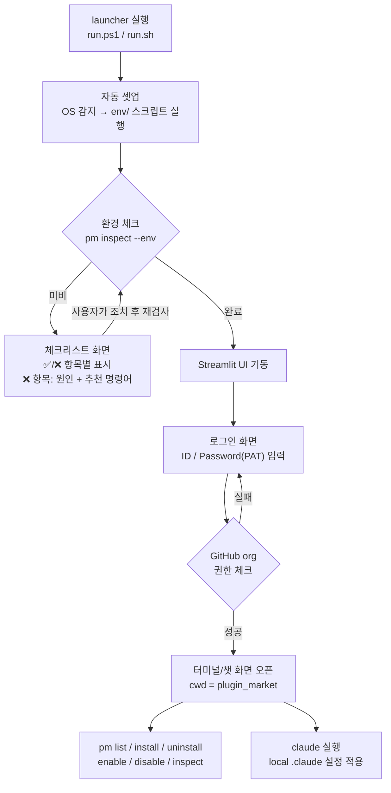
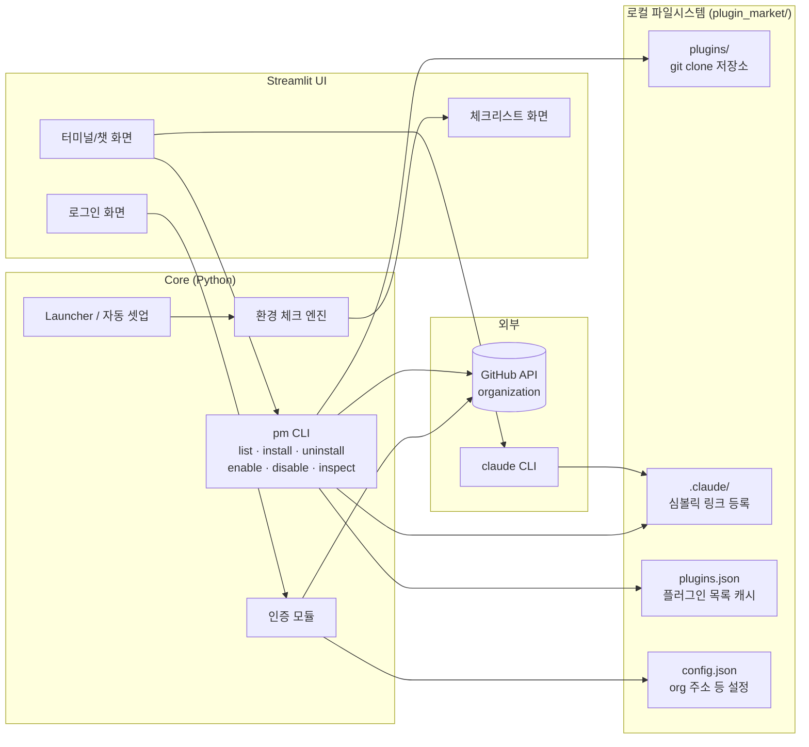
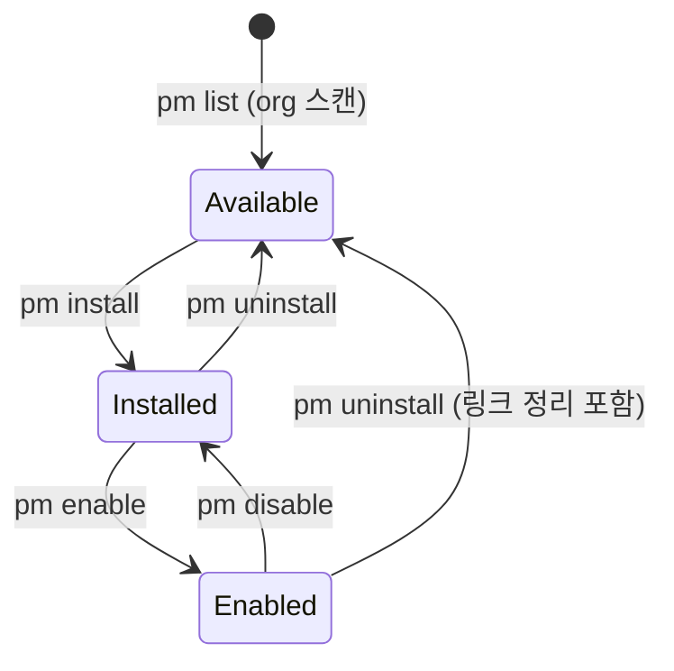

# plugin_market — Architecture

> Claude Code에서 사용할 plugin을 GitHub organization에서 검색·설치·활성화·관리하는 도구.
> 본 문서는 [prompts.txt](../prompts.txt)의 컨셉을 기반으로 한 대략적인 설계문서이다.

---

## 1. 개요 및 목표

### 1.1 목적

- 특정 GitHub organization에 흩어져 있는 Claude plugin들을 **한 곳에서 검색하고 설치/활성화**할 수 있게 한다.
- 사용자는 복잡한 설정 없이 **launcher 하나만 실행**하면 환경 셋업 → 로그인 → 플러그인 관리 → claude 실행까지 이어지는 흐름을 얻는다.
- CLI(`pm`)와 Streamlit UI 양쪽에서 동일한 기능을 제공한다.

### 1.2 핵심 컨셉

| 항목 | 내용 |
|---|---|
| 플러그인 소스 | 특정 GitHub organization의 repo 중 description에 `#plugin` + `#release`가 있는 것 |
| 설치 방식 | `git clone` → `plugins/`에 저장 → `plugin_market/.claude`에 심볼릭 링크 등록 |
| 동작 범위 | plugin_market 디렉토리에서 **local claude**가 동작 (등록/관리 모두 `plugin_market/.claude` 기준) |
| 사용 방법 | `pm` 명령을 PATH에 등록해 어디서든 `pm list`, `pm install` … 형태로 사용 + Streamlit UI |
| 크로스 플랫폼 | Windows / Linux 모두 지원 (`env/`에 OS별 셋업 스크립트) |

---

## 2. 전체 사용자 흐름 (UX 시나리오)



1. **launcher 실행** — 사용자는 실행 파일 하나만 실행한다 (`run.ps1` / `run.sh`).
2. **자동 셋업** — OS를 감지해 `env/`의 해당 OS 셋업 스크립트를 실행한다 (python 가상환경, 의존성 설치, `pm` PATH 등록 등).
3. **환경 체크** — 셋업 후 체크리스트 검사를 수행한다.
   - **미비 시**: 체크리스트 화면을 띄워 항목별 ✅/❌를 표시하고, ❌ 항목에는 원인 설명과 **복사해서 바로 실행할 수 있는 추천 명령어**를 보여준다. 조치 후 "재검사" 버튼으로 다시 확인한다.
   - **완료 시**: Streamlit 메인 UI가 열린다.
4. **로그인** — 설정 파일에 저장된 초기 GitHub organization 주소를 대상으로, 아이디/암호(PAT)를 입력받아 org 접근 권한을 확인한다.
5. **터미널/챗 화면** — 권한 확인이 되면 plugin_market 경로를 cwd로 하는 터미널/챗 화면이 열린다. 여기서 `pm` 명령어를 모두 사용할 수 있고, `claude`를 실행하면 local `.claude` 설정이 적용된 상태로 동작한다.

---

## 3. 시스템 구성도



- **UI와 CLI는 동일한 Core 로직을 공유한다.** Streamlit 화면의 버튼과 터미널의 `pm` 명령은 같은 Python 모듈을 호출한다.
- `claude`는 plugin_market을 cwd로 실행되므로 `.claude/`에 등록(심볼릭 링크)된 플러그인들이 자동으로 적용된다.

---

## 4. 컴포넌트 설계

### 4.1 Launcher & 자동 셋업

| 항목 | 내용 |
|---|---|
| 진입점 | `run.ps1` (Windows) / `run.sh` (Linux) — 저장소 루트에 위치 |
| 역할 | OS 감지 → `env/` 셋업 스크립트 실행 → 환경 체크 → Streamlit 기동 |
| 셋업 항목 | python 가상환경 생성, `pip install -r env/requirements.txt`, `pm` PATH 등록(bin 심볼릭 링크 또는 PATH 추가), git/claude CLI 존재 확인 |
| 멱등성 | 여러 번 실행해도 안전해야 함 — 이미 완료된 항목은 건너뜀 |

동작 의사코드:

```
run.sh / run.ps1
├─ 1. OS 감지 (uname / $env:OS)
├─ 2. env/setup_linux.sh 또는 env/setup_win.ps1 실행 (멱등)
├─ 3. pm inspect --env --json  → 환경 체크 결과 수집
└─ 4. streamlit run scripts/app.py
       ├─ 체크 실패 항목 있음 → 체크리스트 화면
       └─ 모두 통과            → 로그인 화면
```

### 4.2 환경 체크리스트 엔진

각 체크 항목은 `검사 함수 + 실패 원인 메시지 + 추천 명령어`의 셋으로 정의한다. 체크리스트 화면과 `pm inspect --env`가 같은 엔진을 사용한다.

| # | 체크 항목 | 검사 방법 | 실패 시 추천 명령어 (예시) |
|---|---|---|---|
| 1 | git 설치 | `git --version` | win: `winget install Git.Git` / linux: `sudo apt install git` |
| 2 | python ≥ 3.10 | `python --version` | `winget install Python.Python.3.12` / `sudo apt install python3` |
| 3 | 가상환경 + 의존성 | `.venv` 존재, `pip check` | `./env/setup_linux.sh` 재실행 |
| 4 | streamlit 설치 | `import streamlit` | `pip install -r env/requirements.txt` |
| 5 | claude CLI 설치 | `claude --version` | `npm install -g @anthropic-ai/claude-code` |
| 6 | `pm` PATH 등록 | `which pm` / `Get-Command pm` | `./env/setup_linux.sh --register-pm` |
| 7 | GitHub 인증(토큰) | 저장된 토큰으로 `GET /user` 호출 | UI 로그인 화면에서 재로그인 |
| 8 | 심볼릭 링크 권한 (win) | 임시 링크 생성 테스트 | Windows 개발자 모드 활성화 안내 (또는 junction 사용으로 자동 우회) |
| 9 | `.claude/` 구조 | 디렉토리·설정 파일 존재 | `pm inspect --repair` |

**체크리스트 화면 (Streamlit)**:

```
┌─────────────────────────────────────────────┐
│  환경 셋업 체크리스트                       │
├─────────────────────────────────────────────┤
│  ✅ git 설치됨            (git 2.44)        │
│  ✅ python 3.12                             │
│  ❌ claude CLI 없음                         │
│     원인: claude 명령을 찾을 수 없습니다   │
│     👉 npm install -g @anthropic-ai/claude-code   [복사]
│  ❌ pm PATH 미등록                          │
│     👉 ./env/setup_linux.sh --register-pm   [복사]
│                                             │
│              [ 🔄 재검사 ]                  │
└─────────────────────────────────────────────┘
```

### 4.3 로그인 / 인증 모듈

- 초기 GitHub organization 주소는 `config.json`에 보관한다 (예: `https://github.com/my-org`).
- 로그인 화면에서 **아이디 + 암호**를 입력받는다. 단, **GitHub API는 아이디/암호 직접 인증(Basic Auth with password)이 2020년에 폐지**되었으므로, 실제로는 다음 중 하나를 사용한다:

| 방식 | 설명 | 권장 |
|---|---|---|
| **PAT (Personal Access Token)** | 로그인 화면의 "암호" 입력란에 PAT를 입력. `repo`, `read:org` 스코프 필요 | ✅ 1차 권장 — UI 흐름이 단순 |
| OAuth Device Flow | UI에 코드 표시 → 사용자가 github.com/login/device에서 승인 | 확장 옵션 |
| gh CLI 연동 | 이미 `gh auth login` 된 경우 `gh auth token`으로 토큰 재사용 | 편의 옵션 |

- **권한 체크 절차**:
  1. `GET /user` — 토큰 유효성 + 사용자명 확인
  2. `GET /user/memberships/orgs/{org}` — org 멤버십 확인 (실패 시 접근 불가 안내)
  3. 성공 시 토큰을 세션(및 선택적으로 OS 자격증명 저장소)에 보관하고 터미널/챗 화면으로 전환
- 토큰은 평문 파일 저장을 지양하고, 저장이 필요하면 OS keyring(Windows Credential Manager / Secret Service) 사용을 권장한다.

### 4.4 터미널 / 챗 화면

"새 터미널이 열리는 챗팅 같은 화면"은 두 가지 방식으로 구현 가능하며, **병행 제공을 권장**한다.

| | (A) Streamlit 내장 챗 방식 | (B) 실제 OS 터미널 방식 |
|---|---|---|
| 구현 | Streamlit `st.chat_input` / `st.chat_message` + `subprocess`(cwd=plugin_market)로 명령 실행, 출력 스트리밍 표시 | Streamlit 버튼 → `subprocess`로 새 터미널 창 실행 (win: `wt.exe`/`start powershell`, linux: `gnome-terminal` 등), cwd=plugin_market |
| pm 명령 | 챗 입력창에 `pm list` 입력 → 실행 결과를 챗 말풍선으로 표시 | 터미널에서 직접 `pm list` |
| claude 실행 | headless 모드 `claude -p "..." --output-format stream-json`을 subprocess로 실행해 챗 UI로 스트리밍 | 터미널에서 `claude` 그대로 실행 — **실제 claude 대화형 UI 그대로 사용 가능** |
| 장점 | 브라우저 하나로 완결, SSH 환경에서도 동일 | claude 본연의 대화형 경험 (권한 프롬프트, 슬래시 명령 등 완전 지원) |
| 단점 | claude 대화형 기능(권한 승인 등)은 headless 제약 있음 | SSH remote 환경에선 로컬에 터미널을 띄울 수 없음 (이 경우 A 방식 또는 VSCode 내장 터미널 사용) |

- 두 방식 모두 **cwd를 plugin_market으로 고정**하므로, claude 실행 시 local `CLAUDE.md`와 `.claude/` 설정이 그대로 적용된다 → "실제 claude를 사용하는 것처럼" 동작한다.

### 4.5 pm CLI

`pm`은 Python 패키지의 콘솔 엔트리포인트(또는 wrapper 스크립트)로 제공한다. 모든 명령은 Streamlit UI에서도 같은 함수로 호출된다.

#### 플러그인 상태 전이



#### 명령어 명세

| 명령 | 동작 |
|---|---|
| `pm list` | ① GitHub API로 org의 repo 목록 조회 → ② description에 `#plugin`과 `#release`가 **모두** 포함된 repo 필터링 → ③ `plugins.json` 갱신 → ④ 이름/주소/상태(설치·활성화 여부) 테이블 출력. `--cached` 옵션 시 API 호출 없이 캐시만 표시 |
| `pm install [name]` | 인자가 없으면 `plugins.json`의 목록을 번호로 보여주고 선택받음 → `git clone {github addr} plugins/{name}` → `.claude`에 등록(§7의 심볼릭 링크: plugin_root_path + project_path) → `plugins.json`의 상태 갱신 |
| `pm uninstall <name>` | `.claude`의 관련 심볼릭 링크 제거 → `plugins/{name}` 디렉토리 삭제 → 상태 갱신 |
| `pm enable <name>` | `.claude`에 project_path 심볼릭 링크 생성 → 상태 갱신 |
| `pm disable <name>` | 해당 심볼릭 링크 삭제 (clone된 저장소는 유지) → 상태 갱신 |
| `pm inspect [name]` | 플러그인별 상태 점검: 사용가능/설치됨/활성화됨, 링크 유효성(끊어진 링크 감지), 로컬 clone과 원격의 버전 차이. `--env` 옵션 시 §4.2 환경 체크 수행 |

---

## 5. 디렉토리 구조

```
plugin_market/
├─ env/                      # OS별 셋업 스크립트 및 의존성 정의
│   ├─ setup_win.ps1         #   Windows 셋업 (python, 의존성, pm 등록)
│   ├─ setup_linux.sh        #   Linux 셋업
│   └─ requirements.txt      #   Python 의존성 (streamlit, requests 등)
├─ plugins/                  # 설치한 plugin들의 git clone 저장 위치
│   ├─ plugin-a/             #   ex) git clone된 플러그인 프로젝트
│   └─ plugin-b/
├─ .claude/                  # local claude 설정 — 플러그인 등록(심볼릭 링크) 지점
├─ scripts/                  # 동작 파일 (Python 소스)
│   ├─ app.py                #   Streamlit UI 진입점
│   ├─ pm/                   #   pm CLI 패키지 (core 로직 공유)
│   │   ├─ cli.py            #     명령 파싱/디스패치
│   │   ├─ github.py         #     org 스캔, 인증, API 호출
│   │   ├─ installer.py      #     clone / 심볼릭 링크 / 삭제
│   │   ├─ inspector.py      #     상태 점검 + 환경 체크리스트 엔진
│   │   └─ store.py          #     plugins.json / config.json 입출력
│   └─ bin/pm                #   PATH에 등록되는 실행 스크립트(wrapper)
├─ docs/
│   └─ Architecture.md       # 본 문서
├─ data/                     # 상태/설정 파일 (git 미추적 권장)
│   ├─ plugins.json          #   플러그인 목록 캐시 + 상태
│   └─ config.json           #   org 주소 등 설정
├─ run.sh / run.ps1          # launcher (자동 셋업 → 체크 → UI 기동)
├─ CLAUDE.md                 # local claude 지침
└─ README.md                 # User Manual
```

> prompts.txt의 file tree(env, plugins, .claude, docs, Scripts, CLAUDE.md, README.md)를 유지하고, 상태 파일 위치(`data/`)와 launcher(`run.*`)만 추가로 제안했다.

---

## 6. 데이터 설계

### 6.1 `data/plugins.json` — 플러그인 목록 캐시 + 상태

prompts.txt의 최소 스키마 `{plugin name, github addr}`에 상태 관리용 필드를 확장:

```json
{
  "org": "my-org",
  "updated_at": "2026-07-09T12:00:00Z",
  "plugins": [
    {
      "name": "plugin-a",
      "github_addr": "https://github.com/my-org/plugin-a",
      "description": "요약 텍스트 #plugin #release",
      "installed": true,
      "enabled": true,
      "installed_path": "plugins/plugin-a",
      "installed_commit": "a1b2c3d"
    }
  ]
}
```

- `installed` / `enabled`는 실제 파일시스템 상태(clone 존재, 링크 존재)와 다를 수 있으므로, `pm inspect`가 **실제 상태를 기준으로 재동기화**하는 책임을 가진다 (JSON은 캐시, 파일시스템이 진실).

### 6.2 `data/config.json` — 설정

```json
{
  "github_org": "my-org",
  "github_api": "https://api.github.com",
  "terminal_mode": "chat | external",
  "auth": { "storage": "keyring" }
}
```

- 토큰 자체는 config.json에 저장하지 않고 OS keyring 또는 세션 메모리에 보관한다.

---

## 7. 플러그인 등록 메커니즘 (.claude 심볼릭 링크)

### 7.1 흐름

```
pm install plugin-a
├─ 1. git clone https://github.com/my-org/plugin-a  →  plugins/plugin-a
├─ 2. .claude에 등록 (심볼릭 링크 2종)
│     ├─ plugin_root_path : 플러그인 루트를 가리키는 링크
│     │     .claude/plugins/plugin-a  →  ../../plugins/plugin-a
│     └─ project_path     : 활성화 링크 (enable/disable 대상)
│           플러그인이 제공하는 리소스(commands/skills 등)를 .claude 하위에 링크
└─ 3. plugins.json 상태 갱신 (installed=true, enabled=true)

pm disable plugin-a  → project_path 링크만 삭제 (clone은 유지)
pm enable  plugin-a  → project_path 링크 재생성
pm uninstall plugin-a → 모든 링크 삭제 + plugins/plugin-a 삭제
```

> plugin_root_path/project_path 링크가 각각 `.claude` 내부의 정확히 어떤 경로를 가리킬지는 플러그인 저장소의 표준 구조(플러그인이 commands/skills/agents 중 무엇을 제공하는가)를 정한 뒤 확정한다 — §10 미결정 사항 참고.

### 7.2 Windows 심볼릭 링크 주의점

| 이슈 | 내용 | 대응 |
|---|---|---|
| 권한 | Windows에서 `os.symlink`는 관리자 권한 또는 **개발자 모드** 필요 | 환경 체크리스트 8번에서 사전 감지, 개발자 모드 활성화 안내 |
| 대안 | 디렉토리 링크는 **junction**(`mklink /J`)이 일반 권한으로 생성 가능 | symlink 실패 시 junction으로 자동 폴백 (디렉토리 한정) |
| git | clone된 플러그인 내부의 symlink는 git 설정(`core.symlinks`) 영향 | 셋업 스크립트에서 `git config --global core.symlinks true` 안내 |

---

## 8. 크로스 플랫폼 전략

- **구현 언어는 Python**으로 통일 — win/linux 공통 코드, Streamlit과 자연스럽게 결합, `subprocess`/`pathlib`로 OS 차이 흡수.
- OS별 차이는 두 곳으로 격리한다:
  1. `env/setup_win.ps1` vs `env/setup_linux.sh` — 설치/PATH 등록
  2. `installer.py`의 링크 생성부 — symlink/junction 분기
- **Streamlit**: Windows/Linux 모두 공식 지원. `streamlit run`은 로컬 웹서버(기본 8501 포트)로 동작한다.
- **VSCode Remote SSH**: Streamlit이 원격 서버에서 떠도 VSCode가 포트를 자동 포워딩하므로 로컬 브라우저에서 `localhost:8501`로 접속 가능. 즉 SSH 환경에서도 사용 가능하다 (이 경우 터미널은 §4.4의 A 방식 또는 VSCode 내장 터미널 사용).

---

## 9. 검토사항 분석 (prompts.txt 5건에 대한 답변)

| # | 검토사항 | 결론 |
|---|---|---|
| 1 | Streamlit이 win/linux 둘 다 가능? VSCode SSH로 연결해서 사용 가능? | **가능.** 두 OS 모두 공식 지원. SSH remote에서는 VSCode의 포트 자동 포워딩으로 브라우저 접속 가능 (§8) |
| 2 | GitHub organization 권한 확인이 가능한지 (로그인으로) | **가능하나 방식 제약.** 아이디/암호 직접 인증은 GitHub API에서 폐지됨 → "암호" 입력란에 PAT를 받거나 OAuth Device Flow 사용. org 멤버십은 API로 확인 (§4.3) |
| 3 | org의 repo를 스캔해 description의 `#plugin`/`#release`로 필터링 가능? | **가능.** `GET /orgs/{org}/repos`로 전체 repo 목록(설명 포함)을 받아 클라이언트 측에서 문자열 필터링. Search API보다 단순하고 private repo도 토큰 권한만 있으면 조회됨 (§4.5 `pm list`) |
| 4 | Streamlit으로 새 터미널/PowerShell을 열어 챗팅하는 UI 가능? | **가능 (두 방식).** ① Streamlit 챗 컴포넌트 + subprocess 방식, ② 실제 OS 터미널을 새 창으로 띄우는 방식. 병행 제공 권장 (§4.4) |
| 5 | 그 터미널/챗에서 claude를 실행하면 local claude로 실제처럼 사용 가능? | **가능.** cwd를 plugin_market으로 실행하면 local `CLAUDE.md`/`.claude`가 적용됨. 완전한 대화형 경험은 B 방식(실제 터미널), 브라우저 내 챗은 headless(`claude -p`) 기반 (§4.4) |

---

## 10. 미결정 사항 / 향후 과제

| 항목 | 내용 |
|---|---|
| 플러그인 저장소 표준 구조 | 플러그인 repo가 무엇을 제공하는지(commands/skills/agents/hooks)에 대한 규약 필요 → 심볼릭 링크 대상 경로 확정의 선행 조건 |
| Claude Code 네이티브 plugin marketplace | Claude Code에는 자체 plugin/marketplace 기능이 존재함. 심볼릭 링크 방식 대신 네이티브 방식(`.claude-plugin/marketplace.json`) 채택 여부 검토 가치 있음 — 채택 시 install/enable을 claude 표준 기능에 위임 가능 |
| `#release` 태그의 의미 | 단순 "배포됨" 표시인지, 특정 태그/브랜치를 가리키는지 정의 필요. 버전 지정 설치(`pm install name@v1.2`)로 확장 가능 |
| `pm update` | 설치된 플러그인의 `git pull` 기반 업데이트 명령 (inspect가 감지한 버전 차이와 연동) |
| 토큰 보안 | keyring 연동 범위, 세션 만료 정책 |
| 다중 org 지원 | 현재는 단일 org 전제. 필요 시 config에 org 목록으로 확장 |
