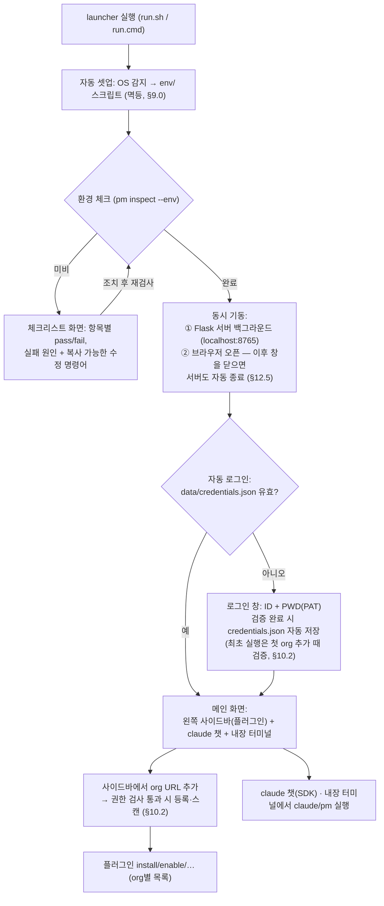
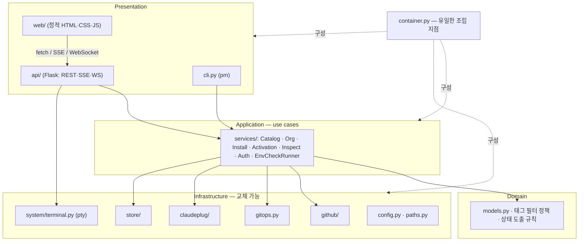
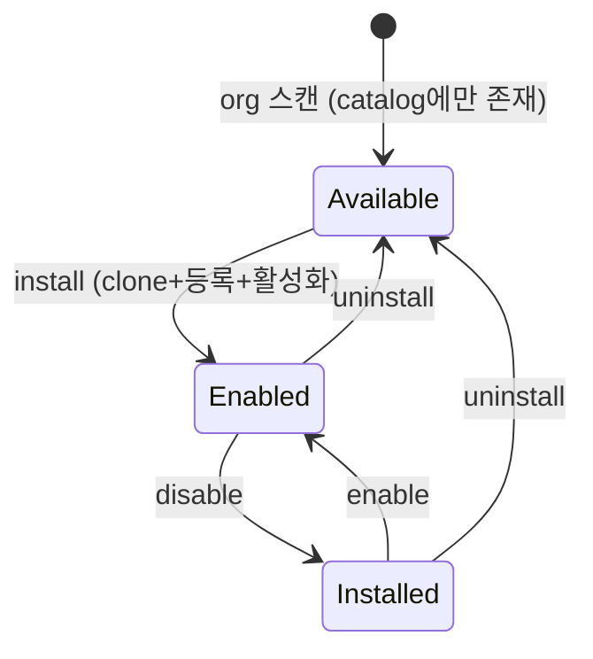

# plugin_market — Architecture

> Claude Code에서 사용할 plugin을 GitHub organization들에서 검색·설치·활성화·관리하는 시스템.
> 원 요구사항 문서(prompts.txt — 현재는 git 히스토리에만 보존, 검토사항 답변은 §14에 수록)를 기반으로,
> 1차 프로토타입(Streamlit, 2026-07 폐기)과 2차 설계(Streamlit+임베드 셸, 2026-07 폐기)를 거쳐
> **HTML/CSS/JS + Flask** 스택으로 확정한 본격 구현용 설계문서이다.
> 사용자 관점 흐름은 [Scenario.md](Scenario.md), 화면 목업은 [mockup/](mockup/) 참고.

---

## 1. 개요 및 목표

### 1.1 목적

- **여러 GitHub organization**에 흩어져 있는 Claude plugin을 한 곳에서 검색·설치·활성화하고 **혼합 사용**한다.
- 사용자는 launcher 하나만 실행하면 환경 셋업 → 체크리스트 → 로그인 → 플러그인 관리 → claude 사용까지 이어지고, **브라우저 창을 닫으면 전부 정리**된다.
- `pm` CLI와 웹 UI(Flask)가 **동일한 core 로직**을 공유한다.

### 1.2 용어

| 용어 | 정의 |
|---|---|
| **plugin** | description에 `#plugin` `#release` 태그가 있는 GitHub repo. Claude Code 플러그인 규약(부록 A)을 따름 |
| **org** | 사용자가 사이드바에서 URL로 등록한 GitHub organization(또는 본인 계정). **권한이 확인된 것만 등록됨** |
| **catalog** | org별 GitHub 스캔 결과 캐시 (`data/plugins.json`) |
| **marketplace** | Claude Code 네이티브 플러그인 등록 지점. 본 프로젝트 루트의 `.claude-plugin/marketplace.json`을 pm이 생성·갱신 |
| **local claude** | plugin_market 디렉토리를 cwd로 실행되는 claude — `CLAUDE.md`와 `.claude/` 설정이 적용된 인스턴스 |
| **preset** | 사용자가 정의한 **플러그인 묶음** — preset 단위로 설치·켜기·끄기·삭제를 일괄 수행하고, "이 preset만 켜기"로 작업 모드처럼 전환(§6.5) |

### 1.3 핵심 컨셉

| 항목 | 내용 |
|---|---|
| 플러그인 소스 | 등록된 org들의 repo 중 description에 `#plugin` + `#release`가 있는 것 |
| 다중 org | **단일 GitHub 서버(host)** 위의 여러 org를 등록해 혼합 사용 (다중 호스트는 로드맵 §15) |
| 설치 | `git clone` → `plugins/{org}/{name}` 저장 → 로컬 marketplace에 등록 |
| 활성화 | Claude Code 네이티브 `enabledPlugins` 토글 (§6) |
| preset | 나만의 플러그인 묶음 — 일괄 실행 + 전환 모드 (§6.5) |
| UI | **정적 프론트(HTML/CSS/JS) + Flask** — 왼쪽 사이드바(플러그인 관리) + 주 화면(claude 챗·내장 터미널) (§12) |
| 수명 | 브라우저 창을 닫으면 Flask 서버도 자동 종료 (§12.5) |
| 사용 방법 | `pm` shim을 PATH에 등록해 어디서든 `pm list` … + 웹 UI |
| 플랫폼 | Windows / Linux (개발은 macOS 포함) |

---

## 2. 설계 원칙 — [코드 규정] 대응

### 2.1 Google Python Style Guide 준수

세부 규칙은 §13. 요약: snake_case 모듈/함수, CapWords 클래스, Google 형식 독스트링, 절대 임포트, 공개 API 타입 힌트 필수, 예외 계층화.

### 2.2 SOLID 적용표

| 원칙 | 본 설계 적용 지점 |
|---|---|
| **S**RP | 프로토타입의 `github.py`(설정읽기+URL정책+HTTP+필터 혼재)를 `config / urls / rest_client / scanner`로 분리. UI(Flask API)는 렌더링·전달만, 로직은 services |
| **O**CP | 새 환경 체크 = `Check` 구현체 1개 추가. 새 GitHub 계열 = `ApiUrlBuilder` 규칙 추가. 새 API 엔드포인트 = blueprint 추가. 기존 코드 수정 없음 |
| **L**SP | `RestGitHubClient` ↔ `FakeGitHubClient`(테스트) ↔ 향후 `GhCliClient`가 `GitHubClient` Protocol 뒤에서 호환 |
| **I**SP | `InstallService`는 `GitRunner+ClaudePluginRegistry+Catalog`만, `ActivationService`는 `ClaudePluginRegistry`만 의존. API blueprint는 필요한 서비스 메서드에만 의존 |
| **D**IP | **container.py(조립 지점) 외에는 어떤 모듈도 구체 클래스를 생성하거나 전역 설정을 읽지 않는다.** API 주소·토큰·경로·태그는 모두 생성자로 주입 |

### 2.3 "변할 수 있는 값" 목록과 변경 방법

> [코드 규정] "github URL은 언제나 바뀔 수 있으므로 변경이 용이" 대응.

| 값 | 기본값 | 변경 방법 (우선순위: CLI 플래그 > 환경변수 > 설정 파일 > 기본값) |
|---|---|---|
| `github_host` | (첫 org URL에서 자동 확정) | 사이드바 org URL / `config.json` / `PM_GITHUB_HOST` |
| `github_api_base` | 호스트에서 규칙 유도 (§10.3) | `config.json`에 명시하면 규칙보다 우선 (수동 override) |
| 등록 org 목록 | 없음 | **사이드바 URL 입력** / `data/orgs.json` / `pm org add` (§7) |
| `plugin_tags` | `["#plugin", "#release"]` | `config.json` |
| `ca_bundle` | 없음 (시스템 기본) | `config.json` — 사내 인증서 환경 (§10.5) |
| `flask_port` | `8765` | `config.json` / `PM_PORT` |
| 프로젝트 경로들 | `paths.py`의 `ProjectPaths` | 테스트에서 주입 교체 |
| 타임아웃/페이지 크기 | `config.py` 상수 | `config.json` |

### 2.4 no-venv 원칙 (해석 명문화)

> [코드 규정] "가상환경 사용안함" — **venv/virtualenv를 일절 만들지 않는 엄격한 해석**을 채택한다
> (내부적으로 venv를 만드는 pipx·uv tool도 배제). 격리 대신 **검증**으로 대응: 버전 충돌은
> 환경 체크리스트가 감지해 수정 명령을 제시한다. 전략 상세는 §9.

---

## 3. 전체 사용자 흐름



- 환경 체크는 **2단계**다: Flask를 띄우는 데 필요한 부트스트랩 체크(python·패키지·포트)는 launcher가 터미널 단계에서 검사·차단하고, 나머지만 웹 체크리스트 화면으로 표시한다(§9.4).
- 체크리스트 화면은 실패 항목마다 "왜 실패했는지 + 지금 실행할 명령어"를 보여주고, 재검사 버튼으로 다시 확인한다.
- 로그인 성공 후에만 org 등록·스캔·설치 기능이 열린다. **PAT는 필수**다(§10.2). 최초 실행은 "미검증 세션"으로 진입해 첫 org 추가 때 검증이 완료된다(§10.2).
- **org는 권한이 확인된 것만 등록·표시된다** — 등록 시 1회 + 매 시작 시 재검증. 특정 org의 권한만 잃으면 그 org만 잠기고, **토큰 자체가 무효일 때만 로그인 창으로 돌아간다**(§10.2).

---

## 4. 레이어 구조



- 의존 방향은 항상 안쪽(추상)으로. Infrastructure는 `typing.Protocol`로 정의된 인터페이스의 구현체.
- **CLI와 웹 API는 동일한 services를 호출한다** — 프로토타입에서 비즈니스 로직이 UI에 새어나간 문제의 재발 방지 규칙. 프론트(web/)는 표시·이벤트 전달만 하고 판단하지 않는다.

---

## 5. 모듈 설계

패키지는 `scripts/pm/` (파이썬 패키지명 `pm`).

| 모듈 | 단일 책임 | 핵심 인터페이스 |
|---|---|---|
| `paths.py` | 프로젝트 경로의 유일한 정의처. `ROOT = Path(__file__)` 기준(cwd 무관) — `ProjectPaths` dataclass로 주입 가능 | — |
| `config.py` | 계층 설정: 기본값 → `data/config.json` → 환경변수(`PM_*`) → CLI 플래그 | `ConfigProvider` |
| `errors.py` | `PmError` → `GitHubError / GitOpsError / RegistryError / ConfigError / AuthError` | — |
| `models.py` | 불변 dataclass: `Plugin(name, org, github_addr, clone_url, description, private, has_tags)`, `Org(url, host, name)`, `PluginState` enum, `CheckResult` | — |
| `github/client.py` | Protocol: `verify_token`, `resolve_target`, `fetch_repos`, `check_org_membership` | `GitHubClient` |
| `github/rest_client.py` | requests 구현체. **생성자로 `api_base_url`, `token_provider`, `ca_bundle` 주입** — 설정을 직접 읽지 않음 | 구현 |
| `github/urls.py` | `ApiUrlBuilder`(host→API base 규칙), `parse_host`, `parse_target`(dot-heuristic) | — |
| `github/scanner.py` | 도메인 정책: description이 설정된 태그를 **모두** 포함하는 repo 필터 | — |
| `store/json_store.py` | `data/*.json` 원자적 입출력(임시파일+rename — CLI·UI 동시 쓰기 대비), 손상 시 기본값+경고 로그, credentials는 권한 600 | `PluginCatalog` |
| `gitops.py` | `GitRunner` Protocol + subprocess 구현: `clone`(토큰은 §11 방식), `pull`, `head_commit`. `GIT_TERMINAL_PROMPT=0` | `GitRunner` |
| `claudeplug/registry.py` | **하이브리드 등록의 핵심** (§6): marketplace.json 생성·갱신, `enabledPlugins` 토글, 규약 검사 | `ClaudePluginRegistry` |
| `services/org_service.py` | **org 등록/삭제/재검증**: URL 파싱 → host 정책 검사 → 멤버십 게이트 → orgs.json 반영 (§10.2) | — |
| `services/catalog_service.py` | `pm list`: 등록 org 전체(또는 지정 org) 스캔 → **보이는 repo 전부 저장**(`has_tags` 플래그 포함) → 출력 시 태그 필터 적용. `--cached`/`--all`은 같은 캐시에서 동작(재스캔 없음) | — |
| `services/install_service.py` | `pm install/uninstall/update`: clone(`plugins/{org}/{name}`) → 등록 / 등록해제 → 삭제(실패 시 부분 clone 정리) / update = pull→재등록(§6.2) | — |
| `services/activation_service.py` | `pm enable/disable`: registry 위임 | — |
| `services/inspect_service.py` | `pm inspect`: 파일시스템·marketplace·enabledPlugins 실측 대조, 규약 검사, `--repair` | — |
| `services/preset_service.py` | **preset CRUD + 일괄 오케스트레이션**(§6.5): 멤버별로 install/activation services를 호출하고 결과 수집, apply(전환) | — |
| `services/auth_service.py` | 로그인(ID/PAT) 검증, credentials.json 자동 저장/로드, 시작 시 org 일괄 재검증 | — |
| `envcheck/checker.py` + `checks.py` | `Check` Protocol + 등록형 체크 목록 (§9.4 표) | `Check` |
| `system/process.py` | cwd=ROOT subprocess 실행, 외부 터미널 실행(보조, OS별) | `CommandRunner` |
| `system/terminal.py` | **내장 터미널의 pty 세션 관리**: 생성(셸 실행, cwd=ROOT)·입출력 중계·리사이즈·종료. POSIX `pty` / Windows `pywinpty`(ConPTY) | `TerminalSession` |
| `api/app.py` | Flask app factory: blueprint 등록, `web/` 정적 서빙, **127.0.0.1 바인딩 강제** | — |
| `api/auth.py` | `POST /api/login`, `POST /api/logout`, `GET /api/session` | — |
| `api/orgs.py` | `GET/POST/DELETE /api/orgs` — org 등록(권한 게이트)·삭제·목록 | — |
| `api/plugins.py` | `GET /api/plugins`(org별 카탈로그), `POST /api/plugins/{org}/{name}/install·enable·disable·uninstall·update`, `GET /api/inspect` | — |
| `api/presets.py` | `GET/POST/DELETE /api/presets`, `POST /api/presets/{name}/{action}` (install·enable·disable·uninstall·apply) | — |
| `api/chat.py` | `POST /api/chat` — claude 챗, **SSE 스트리밍** (Agent SDK, §12.3) | — |
| `api/terminal.py` | `WS /api/term` — xterm.js ↔ pty 양방향 중계 (flask-sock) | — |
| `api/lifecycle.py` | `POST /api/heartbeat`, `POST /api/tab-close` — 서버 수명 관리 (§12.5, 종료 판정은 watchdog 전담) | — |
| `api/workflow.py` | **Workflow 타임라인**(§12.7): `WorkflowStore`(인메모리 링버퍼·SSE 팬아웃) + `POST /api/workflow/events`(hook 수신)·`GET /sessions`·`GET /stream`·`DELETE` | — |
| `hooks/report_workflow.sh` | 관찰 전용 hook 리포터 — stdin JSON을 pm serve로 전달, 항상 exit 0 (§12.7) | — |
| `container.py` | **조립 루트** — 설정 읽기, 구현체 생성·주입은 여기서만 | — |
| `cli.py` + `__main__.py` | argparse 디스패치 → services, 표 출력, 종료코드(0 정상/1 오류/2 사용법). `python -m pm` (launcher는 `pm serve` 실행) | — |

**프론트 (`web/` — 빌드 과정 없는 순수 정적 파일)**:

| 파일 | 역할 |
|---|---|
| `index.html` | 단일 페이지: 로그인 뷰 / 메인 뷰(사이드바 + 챗 + 터미널) 전환 |
| `css/style.css` | 전체 스타일 (사이드바 고정/미고정 전환 포함) |
| `js/app.js` | 부트스트랩: 세션 확인 → 뷰 라우팅, heartbeat 시작 |
| `js/sidebar.js` | org URL 추가/삭제, org별 플러그인 목록 렌더, pin/hover 동작 |
| `js/chat.js` | claude 챗: fetch + SSE 수신 렌더, [새 대화] |
| `js/term.js` | xterm.js 초기화 + WebSocket 연결, 리사이즈 |
| `js/workflow.js` | Workflow 탭: 스냅샷 로딩 + EventSource 구독, 타임라인 렌더 (§12.7) |
| `vendor/xterm/` | xterm.js 로컬 번들 (CDN 미사용 — 오프라인/사내망 대응) |

**테스트 전략이 DIP에서 자동으로 나온다**: services는 Fake 구현체(가짜 GitHubClient, 임시 디렉토리 ProjectPaths, 기록형 GitRunner)로 네트워크·실제 `.claude` 없이 단위 테스트한다. Flask API는 `app.test_client()`로 services를 fake로 갈아끼워 검증한다 (§13.3).

---

## 6. 플러그인 등록 메커니즘 — 하이브리드 (네이티브 marketplace 위임)

### 6.1 결정 배경

원 요구사항은 `.claude`에 심볼릭 링크(plugin_root_path, project_path) 등록을 명시했으나, 프로토타입 검증 과정에서 다음이 확인되어 **등록·활성화를 Claude Code 네이티브 플러그인 시스템에 위임하는 하이브리드 방식으로 재해석**한다:

1. 프로토타입이 사용한 `.claude/plugins/{name}` 링크는 **Claude Code가 읽지 않는 경로**다 (Claude Code가 읽는 것: `.claude/commands|agents|skills|rules/`, `settings.json`).
2. 심볼릭 링크로 가려면 repo 내용물을 종류별로 `.claude/skills/` 등에 나눠 링크해야 하며, Windows에서 symlink 권한(개발자 모드)·junction 제약(절대경로 전용, `Path.is_junction()`은 Python 3.12+, 링크에 rmtree 시 원본 삭제 사고)을 모두 짊어진다.
3. 네이티브 방식은 **링크 자체가 불필요**해 Windows 리스크가 소멸하고, hooks·MCP·버전 관리까지 표준 UX(`/plugin`)로 지원된다.

역할 분담: **pm = clone·인증·카탈로그·규약검사** (사내 GHES PAT 인증은 pm이 처리하므로 claude에 자격증명 전달 불필요) / **Claude Code = 등록·활성화·로딩**.

### 6.2 동작 흐름

```
pm install org-a/plugin-a           (UI에서는 사이드바 버튼)
├─ 1. git clone {clone_url}  →  plugins/org-a/plugin-a     (pm, 토큰은 §11 방식)
├─ 2. 규약 검사: .claude-plugin/plugin.json 존재 등 (부록 A)
├─ 3. .claude-plugin/marketplace.json에 항목 추가·갱신      (pm)
│      마켓플레이스 이름: "plugin-market" (디렉토리명 plugin_market과 달리
│      하이픈 — marketplace name 규칙. enabledPlugins 키의 @ 뒤 부분)
│      { "name": "plugin-market",
│        "plugins": [ { "name": "plugin-a", "source": "./plugins/org-a/plugin-a" } ] }
│      · 항목 name은 기본 repo명, 다른 org와 충돌 시 "{org}-{name}"으로 등록
└─ 4. 활성화: .claude/settings.local.json의
       "enabledPlugins": { "plugin-a@plugin-market": true }  토글

pm disable <name>    → enabledPlugins 값을 false로 (clone·등록 유지)
pm enable  <name>    → true로
pm uninstall <name>  → enabledPlugins 항목 제거 → marketplace.json 항목 제거
                       → plugins/{org}/{name} 삭제 (Windows read-only .git 대응 onexc 포함)
pm update  [org/name] → git pull → marketplace 재등록(캐시 재복사 강제, §6.3)
                        — enabledPlugins 값은 그대로 보존
```

- plugin_market 루트가 곧 **로컬 마켓플레이스**가 된다: source는 상대경로 `./plugins/{org}/{name}` — 저장소를 옮겨도 깨지지 않는다. **여러 org의 플러그인이 하나의 마켓플레이스에 섞여 등록**되므로 claude 입장에서는 출처와 무관하게 동일하게 동작한다(혼합 사용 요구).
- `enabledPlugins`는 머신별 상태이므로 **`.claude/settings.local.json`**(git 비추적)에 둔다. 팀 공통 설정(권한 allowlist 등)은 `.claude/settings.json`(커밋).
- 구현은 settings 파일 직접 편집 또는 `claude plugin enable/disable --scope project` CLI 위임 중 택일 — `claudeplug/registry.py` 뒤에 숨겨 어느 쪽이든 교체 가능(OCP).
- **이름 충돌 규칙**: 먼저 설치된 항목과 그 `enabledPlugins` 키는 **절대 리네임하지 않는다** — 나중에 설치되는 충돌 플러그인만 `{org}-{name}` 항목명을 받는다 (기존 플러그인의 활성 상태가 조용히 풀리는 사고 방지).
- **update의 의미**: `git pull` + marketplace 재등록으로 Claude Code의 캐시 재복사를 강제하되, **활성 상태(enabledPlugins)는 보존**한다 — 꺼진 플러그인은 꺼진 채 새 버전이 된다. 무인자 `pm update`는 활성 여부와 무관하게 설치된 전체를 갱신한다.

### 6.3 주의: 설치 캐시 복사와 플러그인의 root path

Claude Code는 marketplace 플러그인 설치 시 디렉토리 **트리 전체를 캐시로 복사**한다
(`~/.claude/plugins/cache/{plugin}-{version}/` — 내부 구조 보존):

- `plugins/{org}/{name}`에서 `git pull`만 해서는 반영되지 않는다 → `pm update` = `git pull` + **재등록**(§6.2 — 캐시 재복사 강제, 활성 상태 보존)으로 흡수, `pm inspect`가 clone HEAD와 설치본의 차이를 표시.
- **런타임에 플러그인이 보는 "자기 root"는 clone 위치가 아니라 캐시 복사본이다.** Claude Code가 이를 위해 제공하는 공식 변수:
  - `${CLAUDE_PLUGIN_ROOT}` — 설치된(캐시) 플러그인 루트 절대경로. hooks·`.mcp.json`·monitors에서 치환되고 환경변수로도 export됨
  - `${CLAUDE_PLUGIN_DATA}` — 버전 업데이트를 넘어 유지되는 영속 데이터 디렉토리(`~/.claude/plugins/data/{plugin}/`)
- 트리가 통째로 복사되므로 **skill이 자기 폴더 내 파일을 상대경로로 참조하는 것은 그대로 동작**한다 (`skills/x/SKILL.md` → `./scripts/run.py` OK).
- **함정 — cwd**: hook/monitor 스크립트의 작업 디렉토리는 플러그인 폴더가 아니라 **세션 cwd(= plugin_market 루트)**다. "현재 디렉토리 = 내 플러그인 폴더"를 가정한 스크립트는 깨진다 → `cd "${CLAUDE_PLUGIN_ROOT}" && …` 패턴 필수 (부록 A.5 경로 규칙).

### 6.4 상태 모델



**상태는 저장하지 않고 실측으로 도출한다** (프로토타입 검증 원칙 — 저장 상태는 반드시 드리프트한다):
- `Installed` = `plugins/{org}/{name}` 존재 ∧ marketplace.json에 등록
- `Enabled` = Installed ∧ `enabledPlugins["{항목명}@plugin-market"] == true`
- catalog(JSON)는 스캔 캐시일 뿐, 진실은 파일시스템+설정 파일이다. `pm inspect`가 불일치를 감지·`--repair`로 재동기화한다.

### 6.5 Preset — 플러그인 묶음 일괄 관리

사용자가 정의하는 **플러그인 묶음**. preset 하나에 대해 설치·켜기·끄기·삭제를 실행하면 멤버 전체에 일괄 수행되고, "전환"으로 작업 모드처럼 세트를 갈아탈 수 있다.

- **단위는 플러그인이다** — 요구는 "skill 그룹"이지만 Claude Code의 활성화 단위가 플러그인(enabledPlugins)이라 skill 하나만 켜고 끄는 것은 불가능하다. 원하는 skill이 든 플러그인을 멤버로 담는다. (skill 단위 세분화는 로드맵 §15)
- **정의만 저장, 상태는 실측**: `data/presets.json`(§8.5)에 멤버 `org/name` 목록만 저장한다. preset의 상태 뱃지(전부 켜짐 / 일부 / 꺼짐)는 §6.4 규칙으로 멤버 상태를 실측해 도출 — "적용됨" 같은 저장 상태를 두지 않는다.

**일괄 실행 의미론:**

| 동작 | 멤버 각각에 수행되는 것 |
|---|---|
| preset install | 미설치 멤버만 설치 (§6.2 흐름) |
| preset enable | **미설치 멤버는 자동 설치 후** 켜기 — "preset 켜기 = 그 세트가 바로 동작하는 상태" 보장 |
| preset disable | 켜진 멤버 끄기 |
| preset uninstall | 멤버 전체 삭제 — **웹 UI는 인라인 확인 후**(§12.2), CLI는 즉시 |
| **preset apply (전환)** | 멤버 전부 켜기(자동 설치 포함) + **멤버가 아닌 설치본은 전부 끄기**. 삭제는 하지 않는다(비파괴) — "코드리뷰 세트" ↔ "문서작업 세트" 같은 모드 전환 |

- **부분 실패 무중단**: 한 멤버가 실패해도 나머지는 계속 진행하고, 멤버별 결과(성공/건너뜀/실패+사유)를 요약 리포트로 반환한다. 종료코드: 전원 성공 0, 일부 실패 1.
- **깨진 참조**: 멤버가 org 미등록·카탈로그 소멸 상태면 실행 결과에 "참조 깨짐"으로 표시하고 preset 편집에서 정리를 유도한다 (자동 삭제하지 않음).
- **정의 삭제 ≠ 멤버 삭제**: preset 삭제는 목록 정의만 제거한다(플러그인은 그대로). 멤버까지 지우려면 preset uninstall을 먼저.
- 적용 시점 규칙은 동일하다 — enabledPlugins 변경이므로 **새 claude 세션부터 반영**(§12.3). 실행 후 "새 대화부터 적용됩니다" 안내.
- 오케스트레이션은 `services/preset_service.py`가 기존 install/activation services를 호출하는 방식(§5) — 등록 메커니즘(§6.2) 자체는 변하지 않는다.

---

## 7. pm CLI 명세

| 명령 | 동작 | 주요 옵션 |
|---|---|---|
| `pm org add <url>` | URL 파싱 → host 정책 검사(§10.2) → **멤버십 게이트** → orgs.json 등록 + 즉시 스캔 | |
| `pm org list` | 등록 org 목록 + 각 org의 권한 상태 | `--json` |
| `pm org remove <org>` | 등록 해제 — 설치본은 유지되며 '미등록 org' 그룹으로 계속 관리 가능(§12.2), 경고 표시 | |
| `pm list` | 등록 org 전체 스캔(§10) → **보이는 repo 전부 catalog 저장**(has_tags 플래그) → 기본 출력은 태그 통과분만, **org별 그룹** 표 | `--org <name>`, `--cached`, `--all`(같은 캐시에서 태그 필터 해제 — 재스캔 없음), `--json` |
| `pm install [org/name]` | 인자 없으면 catalog 번호 선택 → clone → 규약검사 → 등록 → 활성화 (§6.2) | `--no-enable` |
| `pm uninstall <name>` | 활성화 해제 → 등록 해제 → clone 삭제 | |
| `pm enable <name>` | `enabledPlugins` true | |
| `pm disable <name>` | `enabledPlugins` false | |
| `pm inspect [name]` | 상태 실측 리포트: clone/등록/활성화/규약/버전차 | `--env`(§9.4), `--repair`, `--json` |
| `pm update [org/name]` | git pull + 재등록(캐시 재복사 강제, 활성 상태 보존 — §6.2) · 생략 시 설치된 전체 | |
| `pm preset create/delete <name>` | preset 정의 생성/제거 (delete는 정의만 — 플러그인 무영향, §6.5) | |
| `pm preset add/remove <name> <org/plugin>` | 멤버 추가/제거 | |
| `pm preset list` | preset 목록 + 도출된 상태 뱃지 | `--json` |
| `pm preset install/enable/disable/uninstall <name>` | 멤버 전체 일괄 실행 (§6.5 — enable은 자동 설치 포함, 부분 실패 무중단·요약) | |
| `pm preset apply <name>` | **전환**: 멤버만 켜고 나머지 설치본은 끔 (§6.5) | |
| `pm serve` | Flask 서버 기동 (launcher 내부용 — §12.5 수명 관리 포함) | `--port` |

- 종료 코드: 0 정상 / 1 실행 오류 / 2 사용법 오류. `--json`은 UI·스크립트 연동용.
- **플러그인 식별자 규칙**: 모든 플러그인 명령은 `org/name` 형태를 받는다. bare `name`은 **설치본 중 유일할 때만** 허용 — 여러 org에 같은 이름이 있으면 종료코드 1과 함께 후보 목록(`org-a/plugin-a, org-b/plugin-a`)을 표시한다.
- 웹 UI의 삭제는 인라인 확인(§12.2)을 거치지만, **CLI `pm uninstall`은 관례대로 확인 없이 즉시 실행**한다 (스크립트 사용 대비).
- CLI는 어디서 실행해도 동작한다: shim이 자기 위치로 ROOT를 찾고(§9.3), 모든 파일 연산은 ROOT 기준 절대경로.
- CLI의 인증: `data/credentials.json`(§8.4)을 읽는다 — 웹에서 로그인해 두면 CLI도 바로 동작.

---

## 8. 데이터 설계

### 8.1 `data/config.json` — 설정 (git 비추적)

```json
{
  "github_host": "github.xxx.xxx",
  "github_api_base": null,
  "plugin_tags": ["#plugin", "#release"],
  "ca_bundle": null,
  "flask_port": 8765
}
```

- `github_host`는 **첫 org URL을 추가할 때 자동 확정·저장**된다(§10.2). 이후 다른 host의 org URL은 거부(단일 서버 정책).
- `github_api_base`가 null이면 host에서 규칙 유도(§10.3), 값이 있으면 그대로 사용(비표준 GHE 대응 override).

### 8.2 `data/orgs.json` — 등록된 organization 목록 (git 비추적)

```json
{
  "orgs": [
    { "name": "org-a", "url": "https://github.xxx.xxx/org-a", "host": "github.xxx.xxx", "kind": "org",  "added_at": "2026-07-14T02:00:00+00:00" },
    { "name": "ageokim", "url": "https://github.xxx.xxx/ageokim", "host": "github.xxx.xxx", "kind": "user", "added_at": "2026-07-14T02:10:00+00:00" }
  ]
}
```

- 사이드바 URL 입력 또는 `pm org add`로만 항목이 생긴다 — **등록 시점에 권한 게이트를 통과한 것만** 들어온다(§10.2). `host`는 쓰기 시점에 org_service가 확정값을 넣는다(§5 Org 모델).
- 개인 계정(kind=user)은 본인(로그인 ID == 계정명)일 때만 등록 가능.

### 8.3 `data/plugins.json` — catalog (org별 스캔 캐시, git 비추적)

```json
{
  "updated_at": "2026-07-14T02:20:00+00:00",
  "orgs": {
    "org-a": {
      "scanned_at": "2026-07-14T02:20:00+00:00",
      "plugins": [
        {
          "name": "plugin-a",
          "org": "org-a",
          "github_addr": "https://github.xxx.xxx/org-a/plugin-a",
          "clone_url": "https://github.xxx.xxx/org-a/plugin-a.git",
          "description": "... #plugin #release",
          "private": true,
          "has_tags": true
        }
      ]
    }
  }
}
```

- 원 요구사항의 최소 스키마 `{plugin name, github addr}`를 포함하는 확장형.
- **`installed`/`enabled` 같은 상태 필드는 두지 않는다** — §6.4의 실측 원칙.

### 8.4 `data/credentials.json` — 로그인 자동 저장 (git 비추적, 권한 600)

```json
{ "id": "ageokim", "token": "ghp_..." }
```

- **로그인 성공 시 자동 기록**되고, 이후 시작 시 이 파일로 자동 로그인한다(§12.6) — "한 번 로그인하면 계속 쓴다" 요구의 구현.
- 미리 손으로 작성해 둬도 동작한다 (사전 작성 완전 자동 시작).
- 평문 토큰 파일이므로: 생성 시 **권한 600**, `data/`는 git 비추적, 첫 생성 시 경고 1회 표시. 로그아웃 시 삭제. (OS keyring 전환은 로드맵 §15)
- 자동 로그인이라도 **검증 체인은 매번 수행**된다 — **토큰이 무효(만료·회수)면 로그인 창**으로 돌아가고, 특정 org의 멤버십만 잃은 경우에는 로그인은 유지된 채 **해당 org만 잠긴다**(§10.2).

### 8.5 `data/presets.json` — preset 정의 (git 비추적)

```json
{
  "presets": [
    { "name": "code-review-set", "members": ["org-a/plugin-a", "org-b/plugin-x"], "created_at": "2026-07-14T03:00:00+00:00" }
  ]
}
```

- 멤버는 `org/name` 참조 목록만 — **상태 필드 없음**(§6.5, 실측 도출). preset 이름은 유일해야 한다.
- 개인 설정이므로 비추적. 팀 표준 세트 공유는 로드맵(§15).

### 8.6 `data/env.json` — 고정된 인터프리터 (git 비추적)

```json
{ "python": "/usr/bin/python3.12" }
```

### 8.7 Claude Code 측 파일

| 파일 | 내용 | git |
|---|---|---|
| `.claude-plugin/marketplace.json` | pm이 관리하는 로컬 마켓플레이스 (설치된 플러그인 목록, org 혼합) | 비추적 |
| `.claude/settings.json` | 팀 공통: 권한 allowlist(§12.3), env, **workflow hooks(§12.7)** | 커밋 |
| `.claude/settings.local.json` | 머신별: `enabledPlugins`, provider 전환 env(§12.3) | 비추적 |

---

## 9. 실행 / 환경 전략 (no-venv)

### 9.0 셋업 대원칙 — 멱등(idempotent): 이미 있으면 건너뛴다

launcher(`run.sh`/`run.cmd`)와 `env/` 셋업 스크립트는 몇 번을 실행해도 안전해야 한다.
모든 단계는 **"이미 충족됐는지 먼저 검사 → 충족 시 아무것도 하지 않고 통과"** 순서로 동작한다:

| 항목 | 검사 | 이미 충족 시 |
|---|---|---|
| 패키지 | import + 버전 확인 (`importlib.metadata`) | **pip을 아예 실행하지 않음** (재설치·업그레이드 없음, 오프라인에서도 기동) |
| 인터프리터 고정 | `data/env.json`의 경로가 유효하고 버전 충족 | 재탐색 안 함 |
| `pm` PATH 등록 | `which pm`이 이 checkout의 shim을 가리킴 | 등록 안 함 |
| 디렉토리·설정 파일 | 존재 | 생성 안 함 |

버전이 요구 범위를 벗어난 경우에도 **자동 업그레이드하지 않는다** — 체크리스트(§9.4)가 감지해
수정 명령을 제시할 뿐, 실행 여부는 사용자가 결정한다 (user-site는 머신 전역 공유라 다른
프로젝트에 영향을 줄 수 있기 때문).

### 9.1 핵심 규칙: "인터프리터 고정 + 모든 실행은 `python -m`"

no-venv 환경의 대표 사고는 ① 설치한 python과 실행하는 python이 다른 것, ② console script가 PATH에 없는 것이다. 둘 다 원천 차단한다:

1. 셋업 시 인터프리터 탐색(Windows `py -3` → `python`, Store stub 제외 / Linux `python3` → `python`) 후 **절대경로를 `data/env.json`에 기록**.
2. 이후 모든 실행은 기록된 인터프리터로: `"$PYTHON" -m pm serve`, `"$PYTHON" -m pm list`. → `flask`/`pip` 명령이 PATH에 있을 필요가 없다.

### 9.2 의존성 설치 (PEP 668 대응)

```
"$PYTHON" -m pip install --user -r env/requirements.txt
  └─ 실패가 externally-managed-environment(PEP 668, Debian 12+/Ubuntu 23.04+)면:
     "$PYTHON" -m pip install --user --break-system-packages -r env/requirements.txt 재시도
     (--user 결합 시 시스템 site-packages는 건드리지 않음)
```

- 빠른 경로: `"$PYTHON" -c "import flask, flask_sock, requests"` (+ 3.10 이상이면 `claude_agent_sdk` 포함 — **현 인터프리터에 해당하는** requirements 전 패키지) 성공 시 설치 전체 생략 (멱등·오프라인 친화, §9.0).
- user-site는 머신 전역 공유라 **버전 드리프트가 가능** → 격리 대신 체크리스트가 `importlib.metadata.version()`으로 요구 범위와 대조·감지한다.
- `env/requirements.txt`: `flask>=3.0`, `flask-sock`(터미널 WS), `requests>=2.31`, `claude-agent-sdk ; python_version >= "3.10"`(챗 SDK — 3.8·3.9는 설치 생략, 챗은 subprocess 폴백 §12.3), `pywinpty ; platform_system=="Windows"`(내장 터미널, §12.4).
- 핀 규칙: 모든 핀은 **Python 3.8에서 해석 가능**해야 한다 — 상한·최신 고정 핀 금지, pip이 인터프리터에 맞는 버전을 고르도록 하한만 둔다 (예: 3.8에서는 flask 3.0.x·requests 2.32.x가 자동 선택됨).
- xterm.js는 pip이 아니라 `web/vendor/xterm/`에 **파일로 동봉**한다 (빌드·CDN 없음).

### 9.3 `pm` 노출 — shim + PATH (원 요구사항 "pm.bin")

- `scripts/bin/pm`(POSIX sh): 자기 위치에서 ROOT 계산 → `exec "$PYTHON" -m pm "$@"`. `scripts/bin/pm.cmd`: `%~dp0` 기반 동일 동작.
- ROOT 탐색 우선순위: shim 자기위치 → `PM_HOME` 환경변수(override) → 파이썬 모듈 위치(`paths.py`, 최종 방어).
- PATH 등록(`env/` 셋업, 멱등): Linux는 `~/.local/bin/pm` 심볼릭 링크(로그인 시 자동 PATH 포함), Windows는 `[Environment]::SetEnvironmentVariable("Path", ..., "User")` — **`setx`는 1024자 절단 버그로 금지**. 새 터미널부터 반영됨을 안내.
- launcher 진입점: `run.sh`(linux) / `run.cmd`(windows — 내부에서 `powershell -NoProfile -ExecutionPolicy Bypass -File env\setup_win.ps1` 호출로 실행 정책 우회).

### 9.4 환경 체크리스트 (엔진: `envcheck/`, UI 화면 + `pm inspect --env` 공용)

체크는 **2단계**로 나뉜다 — **A. 부트스트랩 게이트**(항목 1~5, 13): Flask를 띄우기 위한
전제이므로 launcher가 **터미널 단계에서** 검사·차단하고 수정 명령을 터미널에 출력한다.
**B. 웹 체크리스트**(항목 6~12): Flask 기동 후 브라우저 체크리스트 화면으로 표시한다.
(웹 화면이 뜨지 않는 문제는 웹으로 안내할 수 없다는 부트스트랩 역설의 해소)

| # | 항목 | 검사 | 실패 시 수정 명령 (OS별 제시) |
|---|---|---|---|
| 1 | python ≥ **3.8** 발견 | 탐색 규칙(§9.1) + 버전 | `winget install Python.Python.3.12` / `sudo apt install python3` |
| 2 | pinned 인터프리터 일치 | env.json 경로 실존·버전 | 셋업 재실행 (재탐색·재기록) |
| 3 | pip 동작 | `"$PYTHON" -m pip --version` | `"$PYTHON" -m ensurepip --user` |
| 4 | PEP 668 마커 | `EXTERNALLY-MANAGED` 존재 (정보성) | 설치 시 `--break-system-packages` 자동 적용 안내 |
| 5 | 패키지 버전 | import + `importlib.metadata` 범위 대조 (flask, flask-sock, requests, claude-agent-sdk[3.10+만], pywinpty[win]) | §9.2 설치 명령 |
| 6 | git | `git --version` | `winget install Git.Git` / `sudo apt install git` |
| 7 | claude CLI | `claude --version` | `npm install -g @anthropic-ai/claude-code` |
| 8 | `pm` PATH | `shutil.which("pm")`이 **이 checkout의 shim**인지 (타 checkout 오염 감지) | `env/` 셋업 재실행 |
| 9 | GitHub 호스트 도달성 | API base HEAD 요청 (§10.5 인증서 포함, host 미정이면 skip) | 프록시/ca_bundle 설정 안내 |
| 10 | `.claude` 구조 | settings 파일·marketplace.json 정합 | `pm inspect --repair` |
| 11 | credentials 파일 권한 (정보성) | `data/credentials.json` 존재 시 권한 600 확인 | `chmod 600 data/credentials.json` |
| 12 | pty 가용성 | POSIX: `pty` 모듈 / Windows: `pywinpty` import | §9.2 설치 명령 (내장 터미널용) |
| 13 | `flask_port` 사용 가능 | 포트 점유 검사 | 점유 프로세스 안내 또는 config에서 포트 변경 |

각 항목은 `Check` 구현체 하나 — 항목 추가가 기존 코드를 건드리지 않는다(OCP).
3.8·3.9 인터프리터는 항목 1을 **통과**하되 "챗 SDK는 Python 3.10+ — subprocess 폴백으로 동작(§12.3)" 정보성 안내를 함께 표시한다.

---

## 10. GitHub 연동 세부 (프로토타입 검증 사실)

### 10.1 repo 조회 3분기 — 가장 비용이 들었던 학습

| 대상 | 엔드포인트 | 이유 |
|---|---|---|
| organization | `GET /orgs/{name}/repos?type=all` | 토큰 권한 내 private 포함 |
| 타인/일반 user | `GET /users/{name}/repos?type=owner` | **`type=all`은 collaborator로 참여한 남의 repo까지 포함** (오염) |
| **본인** (토큰 로그인 == 대상) | `GET /user/repos?type=owner` | **`/users/{name}/repos`는 토큰이 있어도 public만 반환** — 본인 private는 이 경로만 |

- org/user 판별: `GET /orgs/{name}` 성공 → org, 실패 시 `GET /users/{name}` → user.
- 페이지네이션: `per_page=100` + `Link: rel="next"` 헤더 추적 (누락 시 100개 초과 org에서 조용히 잘림).
- 403 구분: 본문에 rate limit 문구가 있으면 권한 오류가 아니라 **한도 소진**으로 안내한다(로그인 게이트상 항상 인증 상태 5,000/h — 소진 시 `X-RateLimit-Reset` 기준 재시도 시각 표시). GHES는 rate limit이 꺼져 있을 수 있으므로 `X-RateLimit-*` 헤더 존재를 가정하지 않는다.
- 다중 org 스캔은 org별 순차/병렬 조회 후 catalog에 org 키로 저장(§8.3).

### 10.2 인증 — 로그인(ID/PWD)과 org 권한 게이트의 분리

- GitHub은 아이디/암호 API 인증 폐지(2020) — **진짜 GitHub 비밀번호는 어떤 API로도 검증할 수 없다.** 따라서 로그인 창의 PWD 칸은 **PAT**를 받는다 (`repo`, `read:org` 스코프). 토큰 형식(`ghp_*`/`github_pat_*`)으로 검증하지 말 것 — GHES는 형식이 다를 수 있다. **`GET /user` 성공 여부로만 판정**.
- **로그인 검증 = 토큰 유효 + ID 교차 검증**: `GET /user`가 돌려준 토큰 소유자(login)가 입력한 ID와 일치해야 한다(대소문자 무관).
- **host 결정 규칙**: 로그인 창에는 URL이 없으므로 —
  - `config.github_host`가 이미 있으면(과거에 org를 등록한 적 있음) 그 host로 즉시 검증하고, 성공 시 `credentials.json`에 저장.
  - **최초 실행(host 미정)이면 "미검증 세션"으로 진입**: 로그인 제출값(ID/PAT)은 메모리에만 보관되고, 메인 화면에서 **org 추가 외의 기능은 잠긴 상태**다. 첫 org URL 추가 시점에 host 확정 → 토큰·ID·멤버십을 한꺼번에 검증 → **성공했을 때 비로소 credentials.json을 기록**한다.
- **org 추가 실패의 라우팅** (첫 추가 포함): **토큰 무효·ID 불일치** → 로그인 창으로 복귀(입력값 프리필). **멤버십 거부·다른 host의 URL** → 로그인 세션은 유지한 채 사이드바에 인라인 사유 표시(§12.2) — 유효한 토큰을 가진 사용자가 URL 오타 때문에 로그인부터 다시 하지 않도록.
- **org 권한 게이트 (요구 7)**: org 등록 시 `GET /user/memberships/orgs/{org}`(state=active)를 통과해야만 orgs.json에 들어간다 — **권한 없는 org는 등록 자체가 거부되어 목록에 보이지 않는다.** 개인 계정은 본인(ID == 계정명)일 때만 등록 가능.
- **매 시작 시 전 org 재검증**: 자동 로그인 후 등록된 모든 org의 멤버십을 재확인 — 권한을 잃은 org는 사이드바에서 잠금 표시(사유와 함께)되고 스캔·설치 대상에서 제외된다.
- 다른 host의 org URL 추가 시도 → 거부 + "단일 서버 정책" 안내 (다중 호스트는 로드맵 §15).
- 진짜 ID/비밀번호 입력 UX가 꼭 필요해지면: OAuth Device Flow로 GitHub 로그인 페이지에 위임하는 방식이 유일하다 — 로드맵(§15).

### 10.3 호스트 → API base 규칙 ("URL 변경 용이"의 구현)

```
github.com            → https://api.github.com
그 외 (GHES)          → https://{host}/api/v3
config.github_api_base 지정 시 → 그 값 (수동 override, GHE Cloud *.ghe.com 등 비표준 대응)
```

### 10.4 URL 파싱 (dot-heuristic)

org URL 입력은 이름/URL/SSH 어느 형태든 허용: 스킴 제거 → `git@host:org` 정규화 → userinfo(`@`) 조각 제거 → **첫 조각에 점(.)이 있으면 호스트로 보고 버림** (GitHub 계정명에는 점이 올 수 없다). 어떤 호스트가 와도 하드코딩 없이 동작.

### 10.5 사내망 (GHES) 추가 고려

- self-signed 인증서·MITM 프록시는 세 곳을 동시에 깨뜨린다 → config `ca_bundle` 하나로 전파: `requests(verify=...)`, `git -c http.sslCAInfo=...`, claude 실행 env `NODE_EXTRA_CA_CERTS`. `verify=False`는 명시적 opt-in 플래그로만.
- `HTTP(S)_PROXY`/`NO_PROXY` 전파 여부는 체크리스트 항목 9에서 함께 진단.

---

## 11. 보안

| 항목 | 규칙 |
|---|---|
| PAT 보관 | 로그인 성공 시 `data/credentials.json`에 자동 저장(§8.4 — **사용자 결정으로 파일 저장이 기본**). 평문 파일이므로 생성 시 권한 600, git 비추적, 첫 생성 시 경고 1회. 로그아웃 = 파일 삭제. OS keyring 전환은 로드맵(§15) |
| private clone 자격증명 | `git -c http.extraHeader=...`는 **프로세스 인자로 토큰이 `ps`에 노출**(프로토타입 학습) → `GIT_CONFIG_COUNT/GIT_CONFIG_KEY_0/GIT_CONFIG_VALUE_0` **환경변수 방식** 사용 (인자 노출 없음, `.git/config`에도 안 남음). `GIT_TERMINAL_PROMPT=0`으로 인증 실패 시 대기 없이 즉시 오류 |
| Flask 노출 | **`127.0.0.1` 바인딩 강제** (app factory에서 하드코딩 — 외부 인터페이스 바인딩 옵션 자체를 두지 않음). API·SSE·WS 전부 localhost 전용 |
| workflow 이벤트 채널 | `/api/workflow/*`는 무인증 — hook 스크립트에 자격증명이 없고, 127.0.0.1 전용 바인딩이 유일한 신뢰 경계(heartbeat와 동급의 로컬 계측 채널, §12.7). 수신 내용은 저장하지 않는 메모리 링버퍼 |
| 터미널 WS 보호 | 내장 터미널은 임의 명령 실행 통로다 — localhost 바인딩에 더해 **WS 연결마다 토큰 검증**: 인증된 `POST /api/term/token`이 단기(≈30초)·1회용 토큰을 발급하고, 프론트는 모든 WS 연결(신규·재연결·새 터미널) 직전에 발급받아 사용한다. 토큰은 첫 사용 시 무효화 (다른 로컬 프로세스의 무단 연결 차단) |
| 프론트 | 사용자/외부 데이터 렌더링 시 escape 필수 (org명·플러그인 description 등 — XSS 방지). xterm.js 등 vendor는 로컬 동봉만 사용 |
| headless claude 권한 | `--dangerously-skip-permissions` 기본 사용 금지. `.claude/settings.json`의 허용 목록(allowlist) 사전 구성으로 대응 (§12.3) |

---

## 12. 웹 UI 명세 (Flask + 정적 프론트)

### 12.1 화면 구조

```
┌─────────┬──────────────────────────────────────────────┐
│ 사이드바 │ [ Claude ⇄ 터미널 ⇄ Workflow ] [액션 버튼]     │ ← 탭 토글이 액션 버튼 옆
│ (플러그인)│  ┌────────────────────────────────────────┐ │
│         │  │  선택된 뷰 하나가 메인 전체 표시:         │ │
│ 📌 고정  │  │  · Claude 챗 (SSE 스트리밍)              │ │
│ 토글    │  │  · 내장 터미널 (xterm.js,                │ │
│         │  │    cwd=plugin_market)                    │ │
│         │  │  · Workflow 타임라인 (§12.7)             │ │
│         │  └────────────────────────────────────────┘ │
└─────────┴──────────────────────────────────────────────┘
```

- **주 화면 = Claude ↔ 터미널 ↔ Workflow 탭 전환** — 상단 세그먼트 토글([새 대화] 버튼 옆)을 눌러 전환하고, 선택된 뷰가 메인 전체를 쓴다. 액션 버튼은 뷰에 따라 [새 대화]/[새 터미널]/[기록 지우기]로 바뀐다. 플러그인 관리는 왼쪽 사이드바.
- 단일 페이지(`web/index.html`) — 로그인 뷰 ↔ 메인 뷰를 JS로 전환. 프론트는 빌드 과정 없는 순수 HTML/CSS/JS.
- **디자인 언어**: 다크 + 글래스(backdrop-blur) 패널, 인디고→바이올렛 그라데이션 액센트, 이모지 대신 **인라인 SVG 스트로크 아이콘**(`<symbol>`/`<use>` 스프라이트 — 별도 vendor 불필요), 상태 표시는 색점(●)+라벨. 기준 시안: docs/mockup/.

### 12.2 사이드바 (플러그인 파트)

- 구성 (위→아래): **org URL 입력칸**(추가 버튼) → **전역 검색창 + 상태 필터 칩**(모든 org에 걸쳐 필터링하는 단일 컨트롤) → **Preset 섹션** → org별 플러그인 그룹(접기/펼치기, 행 = 이름·설명·상태 배지·버튼) → Inspect 요약.
- **Preset 섹션**(§6.5): [+ 새 preset] 버튼과 preset 행 목록. 행 = 이름 + 멤버 수 + 도출 상태 뱃지(전부 켜짐●/일부◐/꺼짐○) + **[전환]** 버튼 + ⋯ 메뉴(일괄 설치·켜기·끄기·삭제 / 멤버 편집 / 정의 삭제). 멤버 일괄 삭제는 인라인 확인을 거친다. 멤버 추가는 플러그인 행 hover 시 나타나는 **+ preset** 아이콘으로. 일괄 실행 결과는 멤버별 성공·실패 요약 토스트로 표시하고, 실행 후 "새 대화부터 적용됩니다" 안내를 띄운다.
- **org 제거(✕) 후 남은 설치본**: 사이드바의 **'미등록 org' 그룹**으로 계속 표시되어 끄기·삭제가 가능하다 (`pm inspect`도 플래그) — 관리 불가능한 고아 플러그인 방지.
- 목록 UI 원칙 유지: **페이지네이션 대신 검색 + 필터 칩 + 세로 스크롤**.
- 상태 표시명(UI 한국어): `Enabled` → **사용중**(초록점), `Installed` → **꺼짐**(노란점), `Available` → **미설치**(회색점) — 내부 상태명(§6.4)과 CLI 출력은 영문 유지.
- 삭제(🗑 uninstall)는 파일을 지우는 파괴적 동작 — **인라인 확인 단계**("삭제할까요? [삭제][취소]")를 거친 뒤 실행하고, 완료되면 행이 **미설치 + [설치]** 상태로 되돌아간다 (org 카탈로그에는 남아 있으므로 목록에서 사라지지 않음).
- **고정(pin) / 미고정 모드** (요구 4):
  - 헤더의 📌 토글로 전환, 상태는 localStorage에 저장.
  - **고정**: 항상 펼쳐진 상태로 메인 영역 옆에 자리 차지.
  - **미고정**: 평소 접혀서 얇은 레일(아이콘 바)만 보임 → **마우스가 왼쪽 가장자리/레일에 닿으면 슬라이드로 펼쳐지고**, 벗어나면 자동으로 접힘 (CSS transition + mouseenter/leave, 접힘 지연 ~300ms로 깜빡임 방지). 메인 영역이 그만큼 넓어진다.
- org 추가 UX: URL 입력 → 검증 중 스피너 → 성공 시 그룹 추가 + 자동 스캔 / 실패 시 사유 표시("권한 없음", "다른 서버" 등). org 헤더에 새로고침(재스캔)·제거 버튼.

### 12.3 Claude 챗 (Agent SDK)

- 백엔드: `api/chat.py`가 **Claude Agent SDK**(`claude-agent-sdk`)로 세션을 만들고 SSE로 스트리밍. `cwd=ROOT`, `setting_sources=["project","local"]` — local `.claude` 설정·skills·**활성화된 플러그인**이 로딩된다.
- raw `anthropic` 라이브러리로는 불가(Messages API뿐 — skills/plugins 미로딩). 폴백: `claude -p --output-format stream-json` subprocess.
- **Python 버전 게이트**: `claude-agent-sdk`는 Python ≥ 3.10 요구 (코어 최소는 **3.8**, §15 #2) — 3.8·3.9에서는 SDK를 설치하지 않고(§9.2 marker) 챗 백엔드가 위 subprocess 폴백으로 자동 전환한다 (`claude` CLI는 파이썬 버전과 무관). 챗 상단에 정보성 안내 1회.
- **provider 전환**: `.claude/settings.local.json`의 `env` 블록(`ANTHROPIC_BASE_URL`, `ANTHROPIC_AUTH_TOKEN`/`API_KEY`, `ANTHROPIC_MODEL`, `CLAUDE_CODE_USE_BEDROCK/VERTEX`)이 세션에 적용 — 머신별로 provider를 바꿔도 등록된 skill·plugin은 그대로 동작.
- 권한: headless 세션은 승인 프롬프트를 띄울 수 없다 → `.claude/settings.json` allowlist 사전 구성, skip-permissions 금지(§11).
- **[새 대화] 버튼**은 Claude 탭이 활성일 때 표시된다(터미널 탭에서는 [새 터미널], §12.1). **플러그인 적용 시점 = 세션 시작 시** — Install/Enable/Disable은 새 세션부터 반영되므로, Install 직후 "새 대화부터 적용됩니다" 안내를 챗 상단에 표시.
- **`pm` 명령 가로채기**: `^pm\s` 패턴의 입력을, 지원 서브커맨드 allowlist(list·enable·disable·inspect) 한정으로 챗이 services 직접 호출로 처리해 말풍선으로 결과 표시. 그 외 서브커맨드이거나 맨 앞에 공백을 두면(이스케이프) claude에게 그대로 전달.

### 12.4 내장 터미널 (xterm.js + pty)

- 프론트 `js/term.js`(xterm.js) ↔ `WS /api/term` ↔ `system/terminal.py`의 pty 세션(셸 실행, cwd=ROOT).
- POSIX는 표준 `pty`, **Windows는 pywinpty(ConPTY)**. 리사이즈 이벤트 중계, 스크롤백 유지.
- **진짜 셸이므로** 여기서 `claude`(완전한 대화형), `pm list` 등 모든 명령을 그대로 사용 — 원 컨셉("터미널로 열어 챗팅")의 직접 구현. SSH/원격 환경에서도 브라우저만 있으면 동일하게 동작(외부 터미널 창이 필요 없어짐 — OS 터미널 버튼은 보조로 유지).
- **수명 규칙**: 터미널 안에서 `claude` → `exit`하면 셸로 복귀. 셸에서 한 번 더 `exit`하면 **그 pty 세션만 종료** — 터미널 영역에 "세션 종료 — [새 터미널]" 버튼이 표시되고, Flask·페이지·설치 상태에는 영향 없다.
- 브라우저 창이 닫히면 열려 있던 pty 세션도 함께 정리된다(§12.5).

### 12.5 서버 수명 관리 — "창을 닫으면 서버도 꺼진다" (요구 2)

```
run.sh / run.cmd  (환경 체크 통과 후)
├─ ① "$PYTHON" -m pm serve --port 8765  &        (Flask 백그라운드, 127.0.0.1)
└─ ② 브라우저 오픈: open/xdg-open/start http://localhost:8765

수명 관리 (api/lifecycle.py):
· 페이지 JS가 2초 간격 POST /api/heartbeat  (탭별 세션 ID 포함)
· "활성 탭"의 정의: 마지막 heartbeat가 타임아웃(10초 = 5회 연속 누락) 이내인 세션 ID
  — 탭이 어떤 이유로든 사라지면 별도 신호 없이도 10초 뒤 활성 집합에서 자연히 빠진다
· 탭 닫힘(pagehide) 시 navigator.sendBeacon("/api/tab-close", 세션 ID)
  — 그 탭을 활성 집합에서 즉시 제거하는 "표시"일 뿐, 서버를 직접 종료하지 않는다
· 서버 watchdog: 활성 탭 집합이 빈 상태로 유예(10초)가 지속되면 그때 자체 종료
  (새로고침·일시적 백그라운드 전환은 유예 내 복귀. 백그라운드 탭의 타이머
   스로틀링을 감안해 heartbeat 간격 대비 여유 있는 타임아웃을 쓴다)
· 종료 시 정리: pty 세션 종료 → SDK 챗 세션 정리 → 프로세스 exit
```

- 검토 결론: **가능** — 종료 판정의 주체는 오직 watchdog(활성 집합이 비고 유예 경과)이며, tab-close beacon은 판정을 앞당기는 힌트다. beacon이 유실돼도 heartbeat 만료로 같은 결론에 도달하고, 다중 탭·새로고침과 충돌하지 않는다.
- 대안(로드맵): pywebview로 네이티브 창을 띄우면 "창 닫힘 = 프로세스 종료"가 구조적으로 보장되지만, 브라우저가 아닌 별도 창 UX가 된다.

### 12.6 로그인 — ID/PWD 2필드 + 자동 저장 (요구 5·6)

- **입력 필드: ID, PWD(PAT) 두 개뿐.** org URL은 로그인이 아니라 사이드바에서 입력한다(§12.2) — 여러 org를 상황에 따라 추가·제거하는 다중 org 컨셉과 분리.
- 검증: §10.2의 규칙 — host가 알려져 있으면 즉시 `GET /user`+ID 일치 검증, 최초 실행이면 첫 org 추가 시점에 검증.
- **자동 저장(기본 동작)**: **검증이 완료된 시점**에 `data/credentials.json` 기록(§8.4) — host가 알려져 있으면 로그인 성공 즉시, 최초 실행이면 첫 org 추가 검증 성공 시(§10.2). 다음 시작부터는 파일을 읽어 **로그인 창 없이 바로 메인 화면** — 단 검증 체인은 매번 수행되어 **토큰 무효 시 로그인 창으로 폴백**(입력값 프리필), 특정 org 권한 상실은 해당 org 잠금으로 처리(§10.2).
- 로그아웃 버튼 = 세션 종료 + credentials.json 삭제.
- 시작 시퀀스: `credentials.json 존재 → 검증 → 통과 시 메인 / 실패·부재 시 로그인 창`.

### 12.7 Workflow 뷰 — hooks 기반 실행 타임라인

plugin/claude가 수행하는 워크플로우(도구 호출·서브에이전트 단계)를 **세로 타임라인**으로
실시간 표시하는 세 번째 탭. 수집은 Claude Code **hooks**로 하므로 챗(SDK)과
내장 터미널의 대화형 claude **모든 세션**이 잡힌다.

```
claude 세션 (챗 SDK · 터미널 대화형 — 어느 쪽이든)
  → .claude/settings.json hooks (관찰 전용, async, 항상 exit 0)
  → scripts/pm/hooks/report_workflow.sh
      (stdin JSON 그대로 전달 · 포트는 PM_PORT → data/config.json → 8765)
  → POST /api/workflow/events
  → WorkflowStore — 인메모리 링버퍼 (세션 20 · 세션당 step 500)
  → GET /api/workflow/sessions (스냅샷) + GET /api/workflow/stream (SSE 팬아웃)
  → [Workflow] 탭: 세로 타임라인 (진행 중 = 펄스, 완료 ✓, 실패 ✗)
```

- **수집 이벤트**: SessionStart / UserPromptSubmit / PreToolUse / PostToolUse /
  PostToolUseFailure / SubagentStart·Stop / Stop / SessionEnd. hook은 SDK가
  `setting_sources=["project","local"]`로 project settings를 읽으므로(§12.3)
  챗에서도 동일하게 발화한다.
- **관찰 전용 원칙**: 리포터는 어떤 경우에도 세션을 막지 않는다 — `async` 실행,
  connect-timeout 1초, **항상 exit 0**. `pm serve`가 꺼져 있으면 조용히 무시된다
  (루프백 즉시 거부 ≈ 수 ms). 대화형 claude 첫 실행 시 프로젝트 hook
  신뢰 확인이 1회 뜰 수 있다.
- **상태 도출 규칙**: hook 입력에 tool_use id가 없으므로 —
  Pre→`running` step 생성, Post(Failure)는 같은 세션·같은 `tool_name`의
  **가장 최근 running step**을 `done`/`failed`로 마감(LIFO). 짝이 없으면(서버
  재시작 등) 완료 step을 즉석 생성. Stop/SessionEnd 시 잔여 running을 일괄
  마감하고 세션을 idle/ended로. SessionStart 없이 이벤트가 먼저 오면 세션을
  자동 생성한다. 미지의 hook 이벤트는 무시(버전 내성). 동일 도구 병렬 호출
  시 경과시간이 서로 바뀔 수 있는 근사임을 감수한다.
- **서브에이전트 레인**: SubagentStart→스택 push, 이후 도구 step의
  depth=스택 깊이(들여쓰기), SubagentStop→pop — 시간 구간 기반 근사.
- **요약은 서버가 생성**(§13.2 — 프론트는 렌더만): Bash→command 앞 60자,
  Read/Write/Edit→file_path, Task→agent_type, MCP(`mcp__…`)→`is_plugin` 표시
  (`mcp__plugin_{name}_…`이면 플러그인명 배지). 탭에는 [전체|플러그인만] 필터 칩.
- **보관은 서버 메모리만** — §6.4 실측 원칙과 동일하게 저장 상태를 두지 않는다.
  링버퍼 초과 시 가장 오래된 비활성 세션·앞쪽 완료 step부터 절삭.
  [기록 지우기] 버튼 = `DELETE /api/workflow`(전 구독자에 clear 브로드캐스트).
- **SSE 배압**: 구독자별 queue(상한 1000) — 넘치면 그 구독자만 끊고,
  EventSource 자동 재연결 + onopen 스냅샷 재로딩으로 자기 복구. 15초 keepalive.
- `/api/workflow/*`는 무인증 — hook 스크립트는 자격증명이 없고 서버가
  127.0.0.1 전용(§11)이며 heartbeat(§12.5)와 같은 로컬 계측 채널이다.

---

## 13. 코딩 컨벤션 및 품질

### 13.1 Google Python Style 세부

- 네이밍: `module_name.py` / `ClassName` / `function_name` / `_private` / `CONSTANT_CAPS`.
- 독스트링: Google 형식(`Args:` `Returns:` `Raises:`) — 모든 공개 모듈·클래스·함수에 필수, 첫 줄 한 문장 요약.
- 임포트: **절대 임포트만** (`from pm.github import client`), 모듈 단위 임포트, stdlib/서드파티/로컬 그룹 분리.
- 타이핑: 공개 API 전부 주석. 전 모듈 첫 임포트로 `from __future__ import annotations` 선언 — **3.8에서도** annotation에 `str | None`·`list[str]` 문법 사용 가능. annotation 밖(런타임 평가 위치)은 `typing.Optional` 등 사용.
- 예외: bare `except` 금지, `PmError` 계층 사용, `raise ... from e`. 상태값은 문자열 상수가 아닌 **enum**.
- 기타: 4칸 들여쓰기, 80자, `if __name__ == "__main__":`, 가변 기본 인자 금지.

### 13.2 프론트(web/) 컨벤션

- 빌드 도구 없음 — 브라우저가 그대로 읽는 ES 모듈 JS + 일반 CSS. 프레임워크 미사용(바닐라).
- CSS는 커스텀 클래스(`pm-*`) 중심, `css/style.css` 한 곳. 외부 데이터 렌더링은 `textContent` 또는 escape 헬퍼로만 (XSS, §11).
- vendor 라이브러리(xterm.js)는 `web/vendor/`에 파일 동봉 — CDN·npm 미사용.

### 13.3 도구·테스트

- `pyproject.toml`은 **lint/format 설정 전용** (패키징 아님 — 패키지는 pip 설치하지 않고 `python -m`으로 실행). pylint(Google 설정) + formatter. dev 도구는 `env/requirements-dev.txt`로 분리(선택 설치).
- **core는 fake 주입 단위 테스트**: `parse_target`/`has_plugin_tags`/상태 도출/서비스 흐름은 네트워크·실 파일시스템 없이 검증 (tmp 경로 주입).
- **API는 `app.test_client()`** + fake services로 계약 테스트. 프론트 JS는 스모크 수준(핵심 로직을 JS에 두지 않는 것이 전제).
- 실행: `"$PYTHON" -m pytest` (venv 불필요).

---

## 14. 검토사항 답변 (원 요구사항 6건 — Flask 전환 반영)

> 1~5번은 Streamlit을 전제로 한 질문이었다. Streamlit으로도 가능함을 프로토타입으로 검증했으나(2차 설계),
> 이후 **Flask + 정적 프론트로 전환**하면서 결론이 다음과 같이 갱신됐다.

| # | 검토사항 (원문 요지) | 현재 결론 |
|---|---|---|
| 1 | UI가 win/linux 둘 다 가능? VSCode SSH? | **가능.** Flask+브라우저는 두 OS 지원, SSH는 VSCode 포트 자동 포워딩으로 사용 가능. 내장 터미널 덕에 원격에서도 기능 손실 없음(§12.4) |
| 2 | GitHub org 권한 확인(로그인) | **가능(방식 제약).** 암호 인증 폐지 → PWD 칸은 PAT. ID 교차검증 + **org별 멤버십 게이트**(등록 시 + 매 시작, §10.2) |
| 3 | org 스캔 + `#plugin` `#release` 필터 | **검증됨(프로토타입).** repo 목록 API + 클라이언트 필터. private 포함 시 3분기 규칙 필수(§10.1). 다중 org로 확장(§8.3) |
| 4 | 터미널/챗 UI 가능? | **가능 — 개선됨.** Flask 전환으로 브라우저 안에 **진짜 터미널**(xterm.js+pty)을 임베드(§12.4). Streamlit 시절의 "가짜 챗" 제약 소멸 |
| 5 | 그 창에서 claude가 local로 동작? | **가능 — 완전한 형태.** 내장 터미널에서 대화형 claude를 그대로 실행(cwd=plugin_market → local 설정·플러그인 적용). 챗 모드는 SDK로 병행(§12.3) |
| 6 | anthropic 라이브러리 + settings.local.json provider 전환 + skill&workflow | **가능 — 단 Agent SDK로.** raw 라이브러리는 skill/plugin 미로딩. SDK(`setting_sources`)가 `.claude` 설정·skills·플러그인 로딩, provider는 settings.local.json `env` 블록으로 전환(§12.3) |

---

## 15. 미결정 사항 / 로드맵

| # | 항목 | 권장 기본값 |
|---|---|---|
| 1 | 플러그인 repo 규약 확정 | **결정됨(2026-07-15)** — 부록 A를 표준으로 확정, M2 구현 착수. 미준수 repo adapter 여부는 후속 |
| 2 | Python 최소 버전 | **결정됨 — 3.8** (코어·Flask·터미널 전체). `claude-agent-sdk`만 3.10+ 요구 → 3.8·3.9는 챗을 subprocess 폴백으로 제공(§12.3), 설치는 environment marker로 생략(§9.2) |
| 3 | `#release` 의미 | 존재 표시로 시작. 스키마에 `ref` 필드 여지만 두고 `pm install name@ref`는 후속 |
| 4 | 토큰 저장 | **결정됨** — `data/credentials.json` 자동 저장(600, 비추적, §8.4). OS keyring 전환은 후속 opt-in |
| 5 | 다중 GitHub 서버(호스트) | 1차는 **단일 host** (첫 org URL로 확정). host별 credential map으로 확장 가능하게 데이터 구조만 유지 |
| 6 | enable/disable 구현 경로 | settings 파일 직접 편집 vs `claude plugin` CLI 위임 — registry 인터페이스 뒤에서 구현 중 결정 |
| 7 | 디렉토리 명명 | 원 요구사항의 `Scripts`는 **소문자 `scripts/`로 통일** (Google 스타일·대소문자 파일시스템 사고 예방) |
| 8 | 진짜 ID/비밀번호 로그인 UX | PAT 방식 안착 후, 필요 시 OAuth Device Flow(GitHub 로그인 페이지 위임)로 확장 — GHES에 OAuth App 등록 필요 |
| 9 | 네이티브 창(pywebview) | heartbeat 방식으로 충분하나, "창 닫힘=종료"의 구조적 보장이 필요해지면 검토 (§12.5 대안) |
| 10 | 플러그인 이름 충돌 UX | 기본 repo명, 충돌 시 `{org}-{name}` 자동 접두(§6.2) — 표시명 규칙은 구현 중 확정 |
| 11 | preset 팀 공유 | 1차는 개인용(`data/presets.json` 비추적). 팀 표준 세트를 repo에 커밋해 공유하는 형태는 후속 |
| 12 | skill 단위 세분화 | preset 멤버는 플러그인 단위(§6.5) — Claude Code가 skill 단위 토글을 지원하게 되면 재검토 |
| 13 | Windows hook 리포터 | workflow 수집(§12.7)은 sh 스크립트 — Windows는 hook 실패가 무해하게 무시됨. 고정 인터프리터 기반 네이티브 리포터는 후속 |

### 목표 파일 트리

```
plugin_market/
├─ run.sh / run.cmd               # launcher: 셋업 → pm serve + 브라우저 (no-venv, §9·§12.5)
├─ env/                           # OS별 셋업 + requirements
├─ scripts/                       # 동작파일 (원 요구사항의 Scripts)
│  ├─ bin/pm, bin/pm.cmd          #   PATH 등록 shim ("pm.bin")
│  └─ pm/                         #   파이썬 패키지 (§5 — api/ 포함)
├─ web/                           # 정적 프론트 (§5·§13.2)
│  ├─ index.html
│  ├─ css/style.css
│  ├─ js/ (app·sidebar·chat·term·workflow).js
│  └─ vendor/xterm/               #   xterm.js 로컬 번들
├─ plugins/                       # 설치 plugin clone — plugins/{org}/{name} (비추적)
├─ .claude/                       # local claude (settings.json 커밋 / settings.local.json 비추적)
├─ .claude-plugin/marketplace.json# pm이 관리하는 로컬 마켓플레이스 (비추적)
├─ data/                          # config · orgs · plugins · credentials(600) · presets · env .json (비추적)
├─ tests/
├─ docs/                          # Architecture.md · Scenario.md · mockup/
├─ pyproject.toml                 # lint 설정 전용
├─ CLAUDE.md
└─ README.md                      # User Manual
```

---

## 부록 A. 플러그인 repo 표준 규약 (확정 2026-07-15, §15 #1)

plugin으로 인식·설치되기 위한 repo 요건:

1. **repo description**에 `#plugin`과 `#release`를 모두 포함 (스캔 필터 대상, 대소문자 무관).
2. **`.claude-plugin/plugin.json` 필수**:
   ```json
   { "name": "plugin-a", "version": "0.1.0", "description": "..." }
   ```
   `name`은 repo 이름과 일치 권장 (catalog·marketplace 키로 사용).
3. 다음 중 **1개 이상** 제공: `commands/`, `agents/`, `skills/`, `hooks/`, `.mcp.json`.
4. `pm inspect`의 규약 검사 항목: plugin.json 존재·파싱 가능, name 일치, 제공 디렉토리 존재, description 태그 유무.
5. **경로 규칙 (§6.3의 캐시 복사 특성 때문에 필수)** — 플러그인은 설치 시 캐시로 복사되어 원래 위치(`plugins/{org}/{name}`)가 아닌 곳에서 실행된다:
   - 자기 파일 참조: hooks·monitors·`.mcp.json`에서는 **`${CLAUDE_PLUGIN_ROOT}`** 사용 (절대경로·clone 위치 가정 금지)
   - skill 내부: SKILL.md 기준 **상대경로**는 안전 (트리 구조가 보존 복사됨)
   - **cwd 가정 금지**: 스크립트 실행 시 작업 디렉토리는 플러그인 폴더가 아니라 세션 cwd다 — 플러그인 폴더 기준으로 동작해야 하면 `cd "${CLAUDE_PLUGIN_ROOT}" && …`로 시작하거나 `.mcp.json`의 `cwd` 옵션 지정
   - 영속 데이터(설정·상태)는 플러그인 폴더가 아니라 `${CLAUDE_PLUGIN_DATA}`에 기록 (캐시는 업데이트 시 교체됨)
   - 플러그인 폴더 **밖** 참조(`../…`) 금지 — 캐시 설치 후 path traversal이 차단됨

규약 미준수 repo의 처리(최소 plugin.json 자동 생성 adapter 여부)는 규약 확정 시 함께 결정한다.
