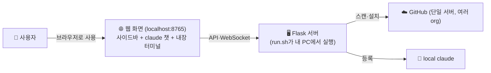
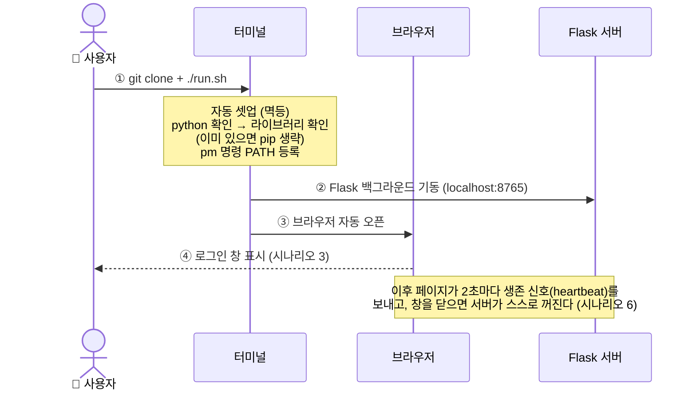
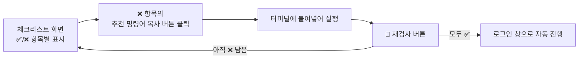
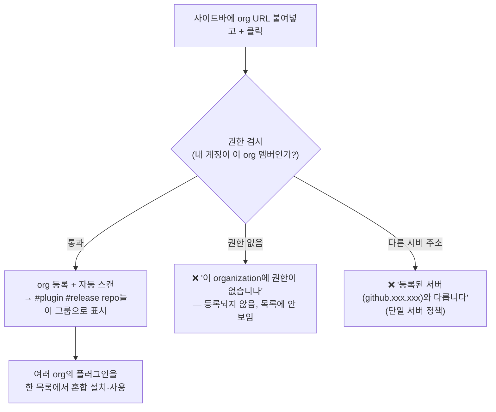
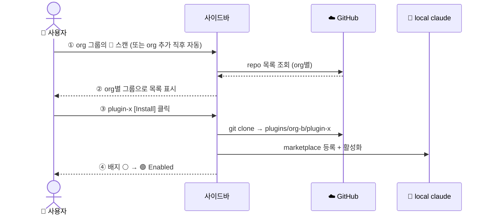
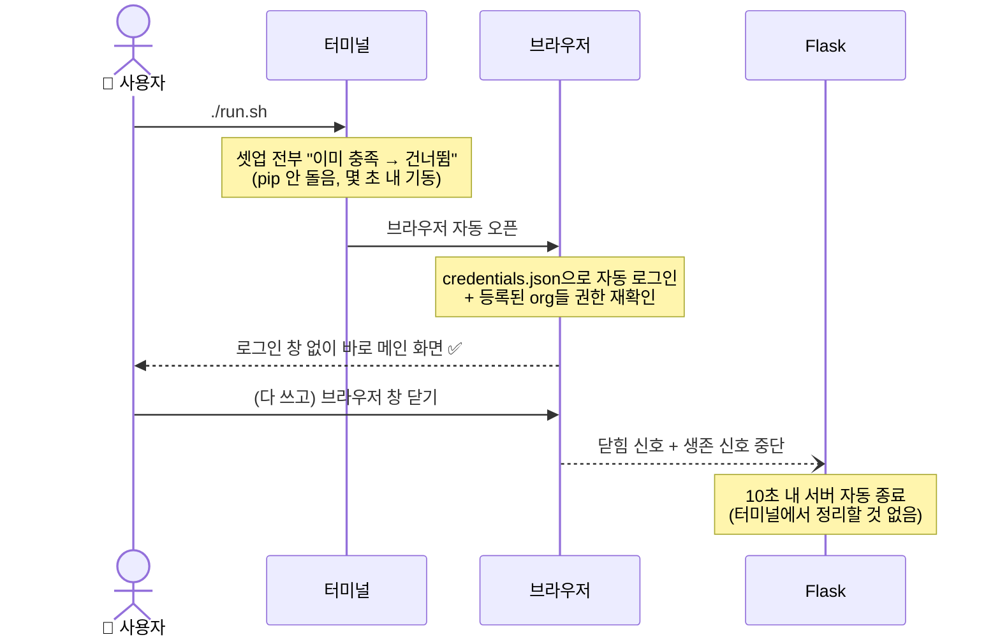
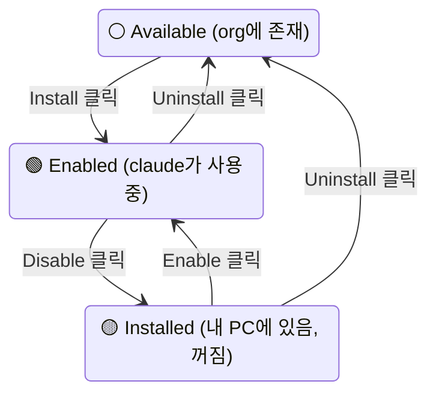
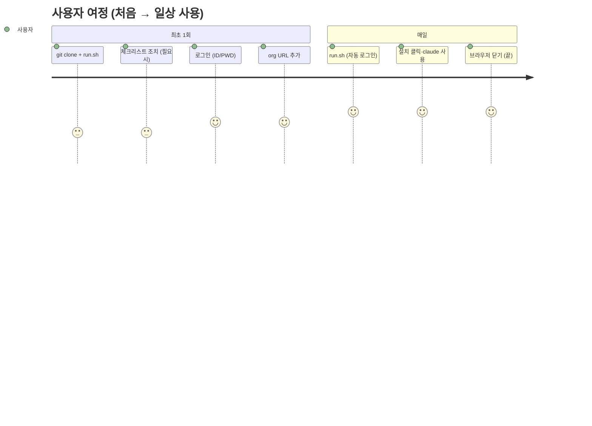

# plugin_market — 사용자 시나리오

> [Architecture.md](Architecture.md)의 설계를 **사용자 입장**에서 단계별로 표현한 문서.
> 각 시나리오는 "사용자가 하는 행동 → 화면에 보이는 것" 기준으로 그렸다. 화면 목업: [mockup/](mockup/)

---

## 0. 등장 요소 — 사용자가 만나는 것들



사용자가 직접 만지는 것은 **두 가지뿐**이다:
1. 터미널에서 `run.sh` 실행 (최초 또는 서버가 꺼져 있을 때)
2. 브라우저 화면 (나머지 전부 — **창을 닫으면 서버도 자동 종료**)

---

## 시나리오 1 — 처음 시작하기 (최초 실행)



**사용자가 하는 일:**

| 단계 | 행동 | 화면/결과 |
|---|---|---|
| ① | `git clone … && ./run.sh` | 터미널에 셋업 진행 로그 |
| ② | (없음 — 자동) | 브라우저가 저절로 열림 |
| ③ | (없음 — 자동) | 로그인 창 |

> 환경이 미비하면 로그인 창 대신 **체크리스트 화면**이 먼저 뜬다 → 시나리오 2.

---

## 시나리오 2 — 환경이 미비할 때 (체크리스트)

```
┌──────────────────────────────────────────────┐
│  환경 셋업 체크리스트                        │
├──────────────────────────────────────────────┤
│  ✅ python 3.12 발견                         │
│  ✅ 라이브러리 (flask·requests·SDK)          │
│  ❌ claude CLI 없음                          │
│      원인: claude 명령을 찾을 수 없습니다    │
│      👉 npm install -g @anthropic-ai/claude-code  [복사] │
│  ❌ pm PATH 미등록                           │
│      👉 ./env/setup_linux.sh                 [복사] │
│                                              │
│               [ 🔄 재검사 ]                  │
└──────────────────────────────────────────────┘
```



**사용자가 하는 일:** ❌ 항목 옆의 명령을 복사 → 터미널에서 실행 → 재검사. 그게 전부다.

---

## 시나리오 3 — 로그인 (ID / PWD 두 칸)

```
┌──────────────────────────────────────┐
│      🧩 Plugin Market — 로그인       │
├──────────────────────────────────────┤
│  ID    [ ageokim                  ]  │
│  PWD   [ ●●●●●●●●●●  (PAT)       ]  │
│                                      │
│            [ 로그인 ]                │
│                                      │
│  · 로그인하면 자동 저장되어 다음부터  │
│    이 창 없이 바로 시작됩니다        │
└──────────────────────────────────────┘
```

- **딱 두 칸**: ID + PWD(PAT — GitHub이 암호 인증을 폐지해 비밀번호 대신 토큰). org 주소는 여기가 아니라 **사이드바에서** 입력한다(시나리오 3.5) — 여러 org를 자유롭게 추가·제거하기 위함.
- 로그인 성공 시 `data/credentials.json`에 **자동 저장** → 다음 실행부터 로그인 창 생략(시나리오 6).
- 검증: 토큰이 유효한지 + 토큰 주인이 입력한 ID와 같은지. (org 권한은 org를 추가하는 순간 검사)
- 최초 실행이라 GitHub 서버 주소를 아직 모르는 경우: 로그인 정보는 보관되고, **첫 org URL을 추가하는 순간** 서버가 정해지면서 한꺼번에 검증된다.

---

## 시나리오 3.5 — organization 추가 (다중 org 혼합 사용)

```
사이드바 상단:
┌─────────────────────────────────────┐
│ 🔗 org 추가                          │
│ [ https://github.xxx.xxx/org-b   ][+]│
├─────────────────────────────────────┤
│ ▼ org-a (3)          🔄 ✕           │
│    plugin-a  🟢 …                   │
│ ▼ org-b (5)          🔄 ✕   ← 추가됨│
│    plugin-x  ⚪ …                   │
└─────────────────────────────────────┘
```



- URL은 저장되어 다음 실행에도 유지된다. org마다 🔄(재스캔)·✕(제거) 버튼.
- **권한이 있는 org만 보인다** — 등록할 때 검사하고, 매 시작 때 재검사해서 권한을 잃으면 잠금 표시.

---

## 시나리오 4 — 플러그인 검색과 설치 (사이드바)



- 목록에는 검색창 + 상태 필터 칩(🟢/🟡/⚪) — 많아져도 페이지 넘김 없이 검색·스크롤.
- 어느 org의 플러그인이든 설치하면 **같은 방식으로 claude에 등록**된다 (혼합 사용).

---

## 시나리오 5 — claude 사용 (주 화면: 챗 + 내장 터미널)

주 화면은 두 부분이다:

```
┌───────────────────────────────────┐
│ 🤖 Claude 챗   [➕ 새 대화]        │  ← SDK 기반 대화 (스트리밍)
│  > 코드리뷰 해줘                   │
│  ⏺ plugin-a: code-review skill …  │
├───────────────────────────────────┤
│ 🖥️ 터미널                          │  ← 진짜 셸 (브라우저 안)
│  $ pm list                        │
│  $ claude        ← 완전한 대화형   │
└───────────────────────────────────┘
```

- **챗**: 브라우저에서 claude와 바로 대화. 설치된 플러그인의 skill이 자동 적용.
- **내장 터미널**: 진짜 셸이다 — `pm` 명령, `claude`(완전한 대화형) 모두 그대로 실행. 원격(SSH)에서도 브라우저만 있으면 동일하게 동작.

### ⚠️ 적용 시점 규칙 — "새 세션부터"

플러그인은 claude가 **시작할 때** 읽어들인다:

| 상황 | 새 플러그인 동작? |
|---|---|
| Install/Enable **후에 새로 시작한** 세션 | ✅ 바로 동작 |
| Install/Enable **전부터 열려 있던** 세션 | ❌ 재시작 필요 |

### 🔄 claude 재시작 방법

- **챗**: [➕ 새 대화] 버튼 클릭 — 그게 전부 (Install 직후 "새 대화부터 적용됩니다" 안내 표시)
- **내장 터미널**:
  ```
  > exit          ← claude 종료, 셸로 복귀
  $ claude        ← 다시 실행 = 새 세션 (플러그인 로딩)
  ```
  셸에서 한 번 더 `exit`하면 그 터미널 세션만 끝나고 "[새 터미널]" 버튼이 뜬다 — 페이지·서버에는 영향 없음.

**재시작이 필요 없는 것들:** Flask 서버 ❌ · 브라우저 페이지 ❌ · run.sh 재실행 ❌ — claude 세션만 새로 시작하면 된다.

---

## 시나리오 6 — 다시 실행 / 끝내기



- **켜기**: `./run.sh` 한 번 — 자동 로그인(저장된 credentials.json)으로 바로 메인.
- **끄기**: 그냥 **브라우저 창을 닫으면 끝** — 서버가 스스로 감지하고 종료된다. 새로고침은 10초 유예 덕에 끊기지 않는다.
- 토큰이 만료됐거나 org 권한을 잃었으면: 자동 로그인이 실패하고 로그인 창(값은 채워진 상태)으로 돌아온다 — **권한 확인은 매번 수행**되므로 우회는 없다.

---

## 시나리오 7 — 플러그인 관리 (사이드바 버튼 기준 상태 변화)



| 버튼 | 일어나는 일 | 이후 claude에서 |
|---|---|---|
| Install | 다운로드 + 등록 + 켜기 | 새 세션부터 사용 가능 |
| Disable | 끄기만 (파일은 유지) | 새 세션부터 안 보임 |
| Enable | 다시 켜기 | 새 세션부터 사용 가능 |
| Uninstall | 끄기 + 등록 해제 + 파일 삭제 | 안 보임 |
| Update | 새 버전 받아 재등록 | 새 세션부터 새 버전 |

- **Inspect**를 열면 각 플러그인의 실제 상태(파일 존재·등록·켜짐, 버전 차이)를 표로 확인 — 뭔가 이상할 때 여기부터 본다.

---

## 한눈에 — 전체 여정 요약



| | 최초 1회 | 두 번째부터 |
|---|---|---|
| 터미널 | `git clone` + `./run.sh` (+ 체크리스트 조치) | `./run.sh` |
| 브라우저 | 로그인 → org 추가 → 설치 | 바로 메인 → claude 사용 |
| 종료 | 브라우저 창 닫기 (서버 자동 종료) | 동일 |
| 소요 | 수 분 | 수 초 |
