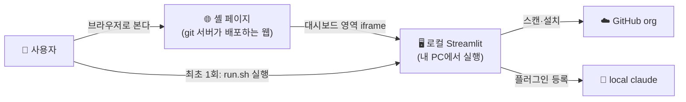
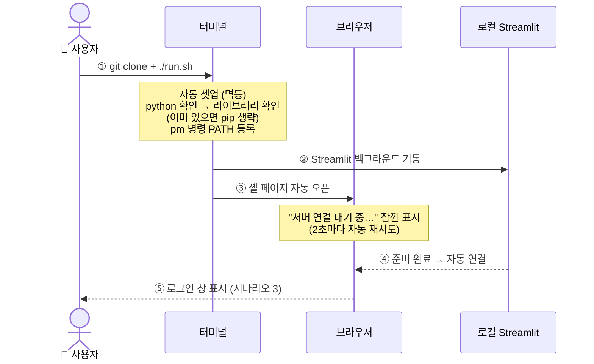
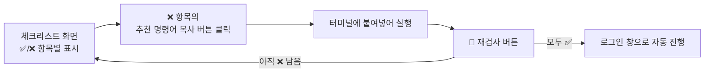
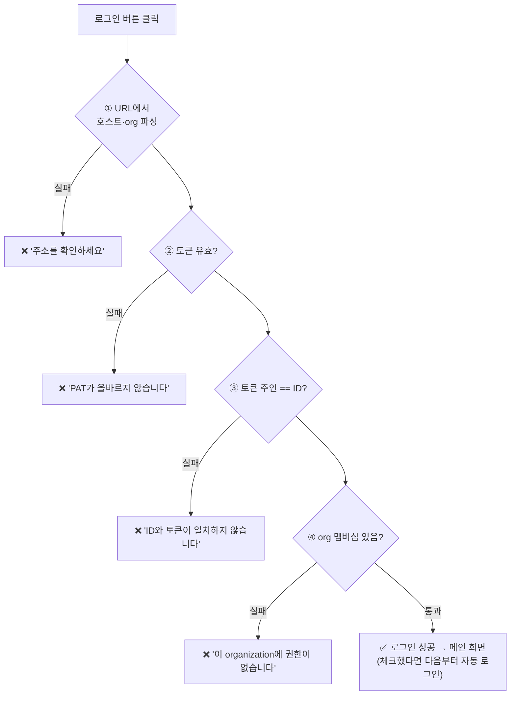
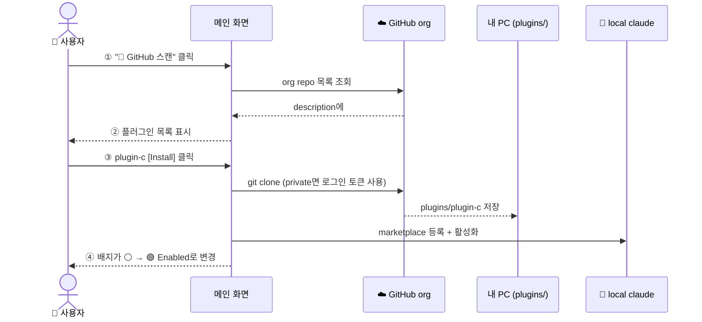
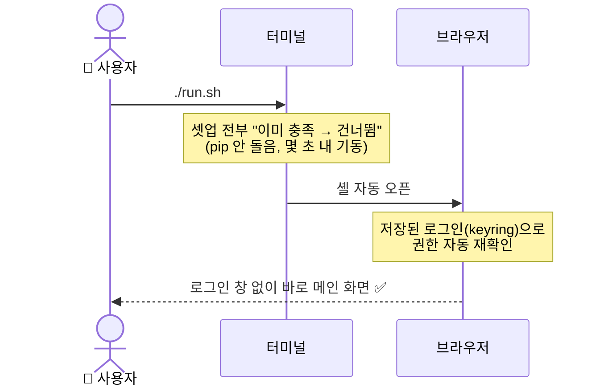
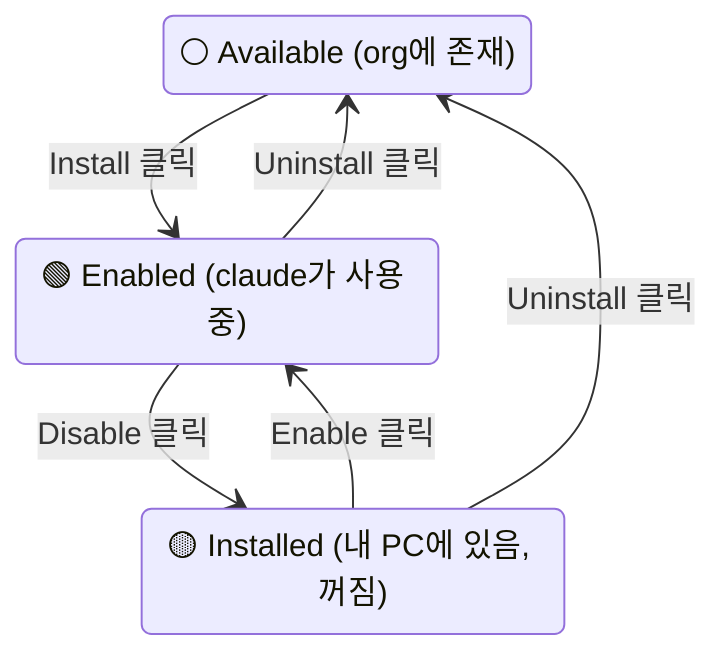
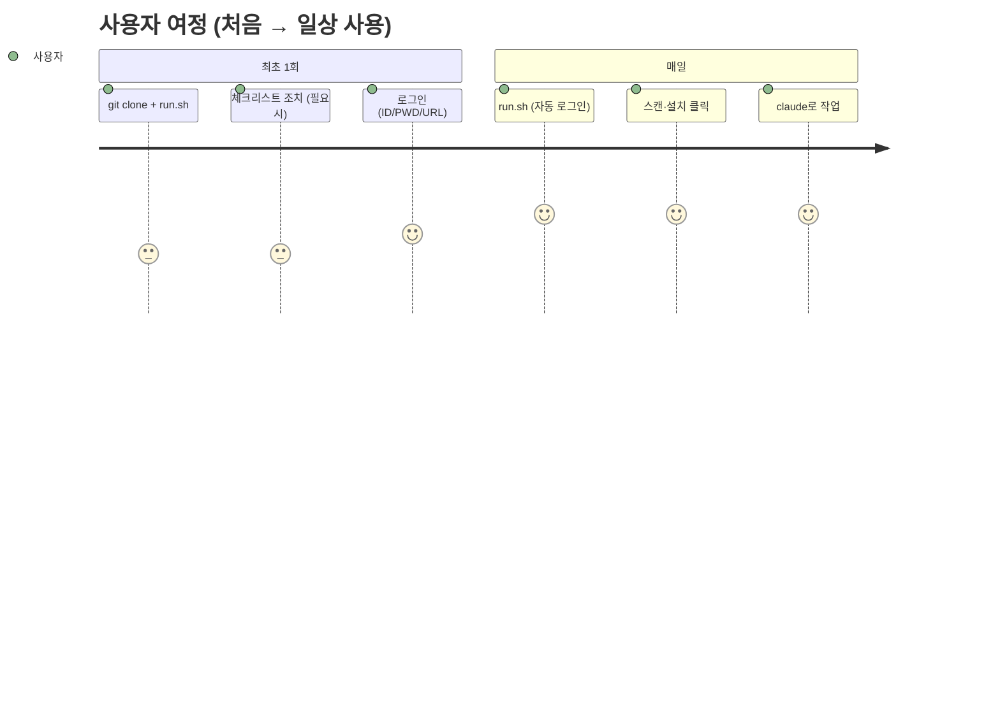

# plugin_market — 사용자 시나리오

> [Architecture.md](Architecture.md)의 설계를 **사용자 입장**에서 단계별로 표현한 문서.
> 각 시나리오는 "사용자가 하는 행동 → 화면에 보이는 것" 기준으로 그렸다.

---

## 0. 등장 요소 — 사용자가 만나는 것들



사용자가 직접 만지는 것은 **두 가지뿐**이다:
1. 터미널에서 `run.sh` 실행 (최초 또는 서버가 꺼져 있을 때)
2. 브라우저 화면 (나머지 전부)

---

## 시나리오 1 — 처음 시작하기 (최초 실행)



**사용자가 하는 일:**

| 단계 | 행동 | 화면/결과 |
|---|---|---|
| ① | `git clone … && ./run.sh` | 터미널에 셋업 진행 로그 |
| ② | (없음 — 자동) | 브라우저가 저절로 열림 |
| ③ | (없음 — 자동) | 잠깐 "연결 대기 중" → 로그인 창 |

> 환경이 미비하면 로그인 창 대신 **체크리스트 화면**이 먼저 뜬다 → 시나리오 2.

---

## 시나리오 2 — 환경이 미비할 때 (체크리스트)

```
┌──────────────────────────────────────────────┐
│  환경 셋업 체크리스트                        │
├──────────────────────────────────────────────┤
│  ✅ python 3.12 발견                         │
│  ✅ 라이브러리 (streamlit·requests·keyring)  │
│  ❌ claude CLI 없음                          │
│      원인: claude 명령을 찾을 수 없습니다    │
│      👉 npm install -g @anthropic-ai/claude-code  [복사] │
│  ❌ pm PATH 미등록                           │
│      👉 ./env/setup_linux.sh                 [복사] │
│                                              │
│               [ 🔄 재검사 ]                  │
└──────────────────────────────────────────────┘
```



**사용자가 하는 일:** ❌ 항목 옆의 명령을 복사 → 터미널에서 실행 → 재검사. 그게 전부다.
무엇이 왜 안 되는지, 어떻게 고치는지를 화면이 다 알려준다.

---

## 시나리오 3 — 로그인 (셸의 첫 화면)

```
┌──────────────────────────────────────────────┐
│        🧩 Plugin Market — 로그인             │
├──────────────────────────────────────────────┤
│  ID    [ ageokim                          ]  │
│  PWD   [ ●●●●●●●●●●●●  (PAT)             ]  │
│  URL   [ https://github.xxx.xxx/myorg     ]  │
│                                              │
│  ☑ 로그인 상태 유지 (자동 로그인)           │
│                                              │
│               [ 로그인 ]                     │
└──────────────────────────────────────────────┘
```

- **URL 한 칸**에 회사 GitHub 주소를 그대로 붙여넣으면 호스트(`github.xxx.xxx`)와
  organization(`myorg`)이 자동으로 분리·인식된다.
- PWD 칸에는 GitHub 비밀번호가 아니라 **PAT**(Personal Access Token)를 넣는다.



어느 단계에서 왜 막혔는지 화면에 그대로 표시되므로, 사용자는 그 항목만 고치면 된다.

---

## 시나리오 4 — 플러그인 검색과 설치

```
┌────────────────────────────────────────────────────────┐
│  🧩 Plugin Market      연결: github.xxx.xxx/myorg  [로그아웃] │
├────────────────────────────────────────────────────────┤
│  [ 🔄 GitHub 스캔 ]   ☑ 태그 필터 (#plugin #release)   │
├────────────────────────────────────────────────────────┤
│  plugin-a  코드 리뷰 자동화     🟢 Enabled   [Disable][Uninstall] │
│  plugin-b  API 클라이언트 생성  🟡 Installed [Enable ][Uninstall] │
│  plugin-c  문서 템플릿          ⚪ Available [Install]            │
├────────────────────────────────────────────────────────┤
│  🔍 Inspect — 상태 상세                                │
└────────────────────────────────────────────────────────┘
```



**사용자가 하는 일:** 스캔 버튼 → 목록에서 Install 클릭. 끝.
clone·등록·활성화는 내부에서 자동 처리된다 (흐름 상세: Architecture.md §6.2).

---

## 시나리오 5 — claude에서 플러그인 사용


- 챗 화면(기본): 브라우저 안에서 claude와 대화 — 원격(SSH) 환경에서도 동일하게 동작
- 터미널 모드(로컬 전용): 실제 터미널 창이 열리고 `claude`를 그대로 사용
- 어느 쪽이든 **방금 Install한 플러그인이 바로 적용**된다 (Enabled 상태 기준)

---

## 시나리오 6 — 다음날 다시 실행 (두 번째부터)



- **셋업은 멱등** — 패키지·PATH·설정이 이미 있으므로 아무것도 재설치하지 않는다 (§9.0)
- **자동 로그인** — "로그인 상태 유지"를 체크해 뒀다면 로그인 창을 건너뛴다.
  단, org 권한 확인은 매번 다시 수행되므로 권한이 회수된 계정은 자동으로 로그인 창으로 돌아간다
- 토큰이 만료된 경우: 로그인 창이 다시 뜨고 "PAT가 올바르지 않습니다" 안내

---

## 시나리오 7 — 플러그인 관리 (사용자 버튼 기준 상태 변화)



| 버튼 | 일어나는 일 | 이후 claude에서 |
|---|---|---|
| Install | 다운로드 + 등록 + 켜기 | 바로 사용 가능 |
| Disable | 끄기만 (파일은 유지) | 안 보임 |
| Enable | 다시 켜기 | 다시 사용 가능 |
| Uninstall | 끄기 + 등록 해제 + 파일 삭제 | 안 보임 |
| Update | 새 버전 받아 재등록 | 새 버전 사용 |

- **Inspect** 화면을 열면 각 플러그인의 실제 상태(파일 존재·등록·켜짐 여부, 버전 차이)를
  표로 확인할 수 있다 — 뭔가 이상할 때 여기부터 본다.

---

## 한눈에 — 전체 여정 요약



| | 최초 1회 | 두 번째부터 |
|---|---|---|
| 터미널 | `git clone` + `./run.sh` (+ 체크리스트 조치) | `./run.sh` |
| 브라우저 | 로그인 → 스캔 → Install | 바로 메인 → claude 사용 |
| 소요 | 수 분 | 수 초 |
